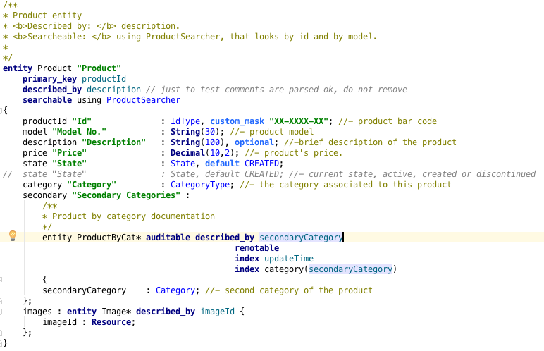
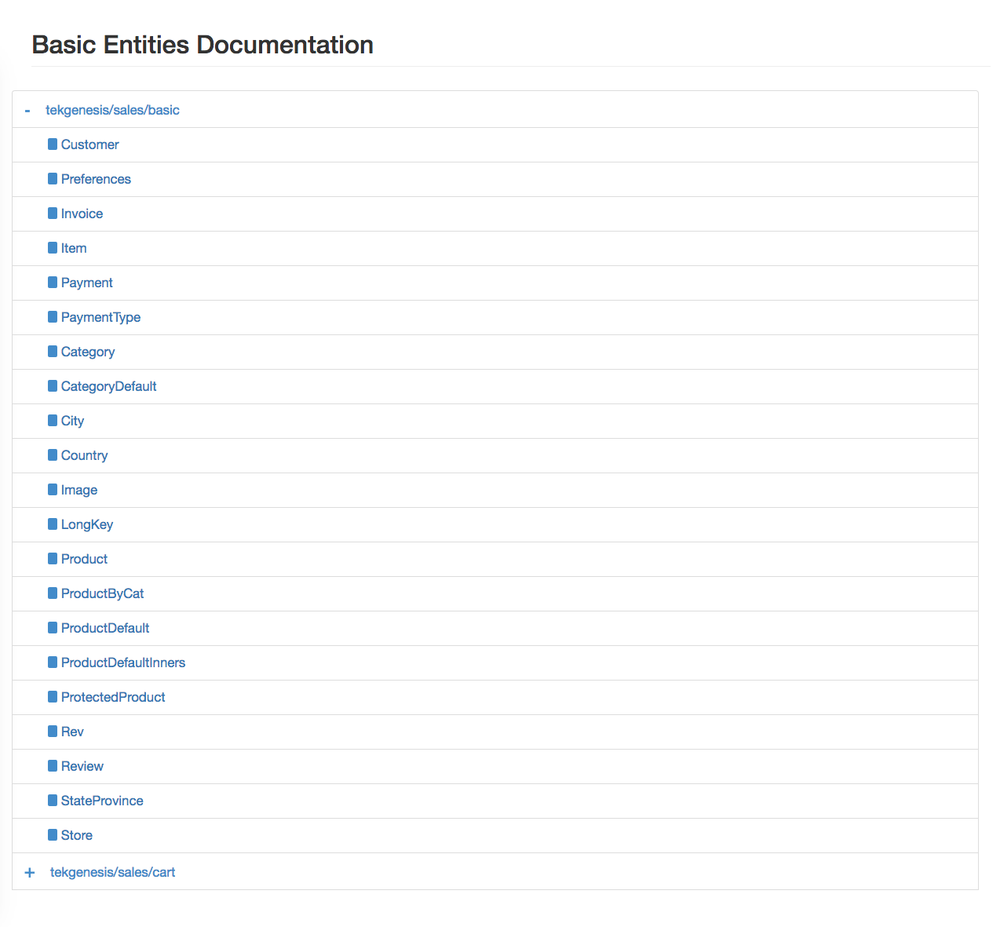
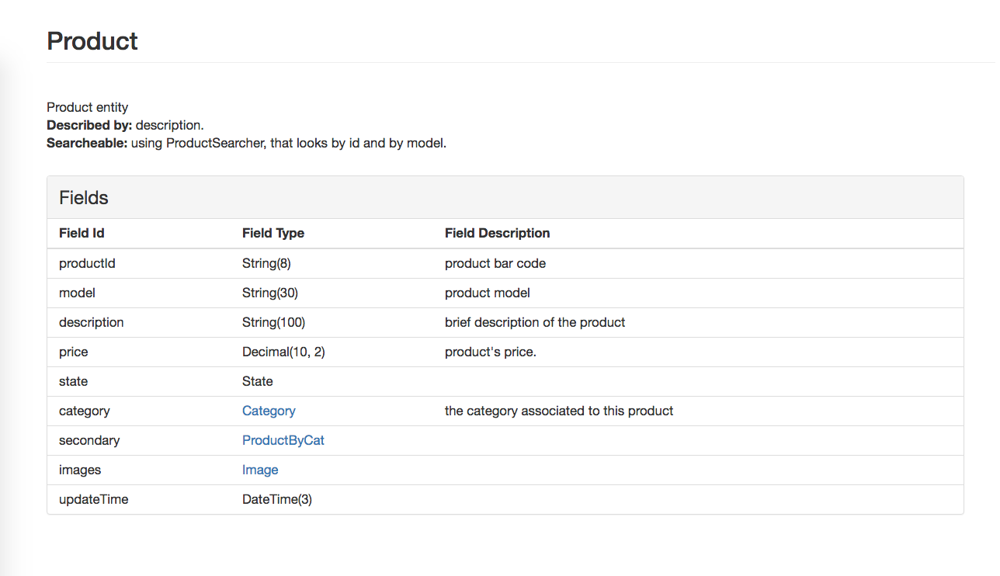

# Metamodel Documentation

Entity documentation is available though a JavaDoc like manner. 
Documentation for top level entities and inner ones is supported as well as description for each field.

Once an entity is documented, Sui Generis will take those descriptions, and associate them to the entity, in order to generate the .html documentation files.

## Documentation Conventions

Documentation conventions must be followed so entity and field documentation can be distinguished from any other comment placed in the MetaModel file.

*There are two ways of documenting:*

* Two star block comment : such as Javadoc, we use a block comment starting with two stars instead of one (/**  */). This kind of multiline entity documentation should be placed **before** the corresponding entity.   
* Dash line comment : this is a common line comment immediately followed by a dash (//-). This kind of field description should be placed **following** the field in question, after the semicolon.  

## Example

@inline-code(doc/samples/doc-project/src/main/mm/tekgenesis/doc/Documented.mm#mm_documentation)

Now with some colors, to distinguish the documentation:

## Gradle Task - Documentation Generation

In order to generate this html documentation files, the "mmDoc" gradle task must be run. 
To build documentation simply invoke that task from your project root. This will generate the files in a directory mmdoc/ in your project's root.

Inside mmdoc/ directory there will be the index file for each module from where it can be navigated to each entity of the module.

## How Documentation Looks

