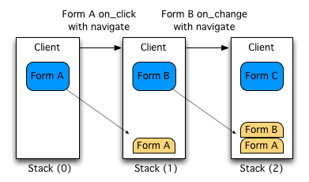
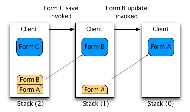
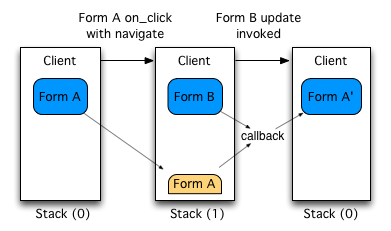
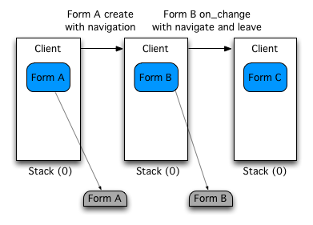

# Navigating from a Form to another

Every time the application is started, default home page loads a menu and a page consisting on a search bar, and two lists displaying recent and favorites forms. Once a form is selected on the menu, the application navigates to a new instance of given form.

After the user has interacted with the specified form, a termination method is eventually invoked (create, update, or delete) returning a default action. The default action in given context is to stay, meaning: the application navigates to a new instance of the terminated form.

But eventually, during of after users are interacting with a given form, a navigation to another form may be desired, and the application handles all sort of combinations and behaviors to achieve a performant and ease stateless navigation.

# Actions

Most sync and termination methods on forms returns an Action. Every form instance has an *Actions* utility class instance field named *actions*. *Actions* utility class provide a factory to all supported actions:

|Action Type|Construction|Description|
|-----------|------------|-----------|
|Default|actions.getDefault()|Returns the default action, which may resolve to different behaviors depending on invocation context.|
|Error|actions.getError()|Returns the error action, which will prevent any further action to be executed. Eg: returning an error action on a form terminate method such as create, update, or delete will not terminate form lifecycle, but will return to interaction.|
|Navigate|actions.navigate()|Returns a navigation action. Navigation can be to a new form instance, or to a specified instance if primary key was provided. Also navigation action may specify leave, dialog, and callback options. More on [Navigate](#navigate) action.|
|Detail|actions.detail()|Returns a detail action. Detail action prompts the specified form instance on a dialog.|
|Swipe|actions.swipe()|Returns a swipe action. Swipe actions allows to detail a sequence of instances. A SwipeLoader instance class must be specified. Optional fetch size and cyclic behavior can also be specified. Note that it's thought specially for read-only views. Beware that Swipe supports navigation but always leaving the form. |
|Redirect|actions.redirect()|Returns a redirect action. Location on browser is updated to specified url.|


## Default
**Construction:** actions.getDefault()
**Description:** Returns the default action, which may resolve to different behaviors depending on invocation context.|
**Code:**

```java
/** Update profile image if twitter account changes. */
@NotNull @Override public Action twitterChanged() {
    if (isDefined(Fields.TWITTER)) {
        final TwitterApi.User user = getUser(getTwitter());
        if (user != NONE) setImage(user.getProfileImage());
    }
    return actions.getDefault();
}
```

## Error
**Construction:** actions.getError()
**Description:** Returns the error action, which will prevent any further action to be executed. Eg: returning an error action on a form terminate method such as create, update, or delete will not terminate form lifecycle, but will return to interaction.
**Code:**

```java
/** Invoked when creating a form instance */
@NotNull @Override public Action create() {
    final boolean valid = Codes.validate(getCode(), getAmount());
    return valid ? super.create() : 
        actions.getError().withMessage("Invalid code/amount!");
}
```

## Navigate
**Construction:** actions.navigate()
**Description:** Returns a navigation action. Navigation can be to a new form instance, or to a specified instance if primary key was provided. Also navigation action may specify leave, dialog, and callback options. More on [Navigate](#navigate) action.
**Code:**

```java
/** Invoked when creating a form instance */
@NotNull @Override public Action create() {
    super.create();
    return actions.navigate(Preferences.class, getClientId())
        .withMessage("Please fill preferences or skip.");
}
```

## Detail
**Construction:** actions.detail()
**Description:** Returns a detail action. Detail action prompts the specified form instance on a dialog.
**Code:**

```java
/** Invoked when clicking detail button */
@NotNull @Override public Action click() {
    return actions.detail(Details.class, getClientId());
}
```

## Swipe
**Construction:** actions.swipe()
**Description:** Returns a swipe action. Swipe actions allows to detail a sequence of instances. A SwipeLoader instance class must be specified. Optional fetch size and cyclic behavior can also be specified. Note that it's thought specially for read-only views. Beware that Swipe supports navigation but always leaving the form. 
**Code:**

```java
/** Invoked when clicking detail button on table row. */
@NotNull @Override public Action click() {
    return actions.swipe(CarSwiper.class, getCars())
        .fetchSize(3).cyclic();
}
```

## Redirect
**Construction:** actions.redirect()
**Description:** Returns a redirect action. Location on browser is updated to specified url.
**Code:**

```java
/** Google it! */
@NotNull @Override public Action googleIt() {
    return actions.redirect(
        "https://www.google.com/#q=" + getQuery());
}
```

# Customizing message

**Construction:** action.withCustomMessage("Message")
**Description:** Returns a CustomMessage object. It allows to customize the action message, providing styling methods (error, success, warning) and the possibility of switching off the auto hiding.
**Code:**

```java
@NotNull @Override public Action defaultWarningPersistent() {
    final Action action = actions.getDefault();
    action.withCustomMessage("This is a customized action, with warning style and autohiding off").warning().sticky();
    return action;
}
```


# Navigate

Navigate action is far the most common action after the default one. Allows specified flow between forms, handling callbacks and nested navigation. Sui Generis uses a stateless communication protocol between server and client, therefore does not require the server to retain navigation information, or status about each communications partner for the duration of multiple requests. Due to that, the navigation stack is fully kept on the client.

## Navigate to a new form

```java
@NotNull @Override public Action feedback() {
    return actions.navigate(FeedbackForm.class)
        .withMessage("Please! Give us your feedback!");
}
```

Submitting a form class to *actions.navigate*, as in the above *feedback()* example, will create a navigate action. Returned action will make the application navigate to a new *FeedbackForm* instance.

##  Navigate to a form with primary key

```java
@NotNull @Override public Action details() {
    return actions.navigate(ProductDetailsForm.class, getProductId());
}
```

Submitting a form class and a primary key to *actions.navigate*, as in the above *details()* example, will create a navigate action. Returned action will make the application navigate to a *ProductDetailsForm* instance populated with given product key.

## Navigate to an instantiated form

```java
@NotNull @Override public Action survey() {
    final SurveyForm survey = forms.instantiate(SurveyForm.class);
    survey.setCustomer(getUser());
    survey.setProduct(getProduct());
    if(isNewCustomer()) survey.setRewardOnCompletion(Rewards.COUPON);
    return actions.navigate(survey);
}
```

Every form instance has a *Forms* utility class instance field named *forms*. *Forms* utility class provides all sort of forms related operations such as *instantiate*, which returns a new form instance, populated with primary key if provided. Returned instance on* forms.instantiate()* can be used to interact with a form as if given form was loaded by the application.

Submitting a form instance to *actions.navigate*, as in the above *survey()* example, will create a navigate action. Returned action will make the application navigate to a *SurveyForm* instance with values set matching the above example.

## Navigate to a form with parameters

```java
@NotNull @Override public Action survey() {
    return actions.navigate(SurveyForm.class)
                   .withParameters(
                    SurveyForm.parameters().withName("My Parameter Name")
                                .withOneDate(DateTime.current())
                                .withSomeInt(3)
                                .withOneDateTime(DateOnly.current())
                                .withDecimal(BigDecimal.valueOf(32.5))
                                .withOneEntityKey("122"));
}
```

If the form the user wants to navigate to has the *parameters* option defined, an inner class, for example *SurveyFormParameters*, will be generated with methods to define each parameter.

Also a static method *parameters()* will be generated at form base level to obtain a *SurveyFormParameters* instance. This instance is the only argument in the *withParameters(SurveyFormParameters)* method inside the *Navigate* action.

# Callbacks

As mentioned before, Sui Generis uses a stateless communication protocol between server and client, therefore does not require the server to retain navigation information, or status about forms. Each time a navigation is performed during a form interaction method, the previous state is kept on a client's stack.

All forms kept on the stack, will eventually be restored. When the target navigation form terminates, previous stacked forms are restored. At the time stacked forms are restored, optionally defined callbacks are invoked, to allow any data mapping and manipulation between target and source forms.

## Stack navigation



In the above example, navigation from Form A to Form B, and from Form B to Form C occurs during form interaction methods. When a navigation occurs during a form interaction, the state of the source form is kept on a stack on client.



When a form terminates on a save, cancel or delete submission, if any previous form was kept on the stack, it is restored.

## Mapping Callback Class



When returning a navigate action during form interaction, a callback class can be specified on action as well. The callback must be a static class, and should extends abstract class MappingCallback, parameterized with source and target forms.

```java
@NotNull @Override public Action address() {
    return actions.navigate(AddressForm.class).callback(AddressToCustomerFormCallback.class);
}
...
public static class AddressToCustomerFormCallback extends MappingCallback<AddressForm, CustomerForm> {
    @Override public void onSave(@NotNull AddressForm addressForm, @NotNull CustomerForm customerForm) {
        final Address address = addressForm.find(); // Find the bound entity object on AddressForm
        customerForm.setAddress(address); // Assign created object on customer field.
    }
}
```

In the above example, the created address will be set on the customer form address field. **Note: for simplified cases as the above, a mapping callback field should be used. See below.**

## Mapping Callback Field

When returning a navigate action during form interaction, a callback field can be specified on action as well. The callback field tells the application to attempt to assign the bound entity of the target form (if any) to the specified field on the origin form.Simplifying the above Mapping Callback Class example, instead of defining a callback class, the field on the origin form matching the bound entity of the target form can be specified.

```java
@NotNull @Override public Action address() {
    // If AddressForm bound entity matches type of address field, then an assignment callback is automatically generated.
    return actions.navigate(AddressForm.class).callback(Fields.ADDRESS); 
}
```

## Leave and terminate

Navigation behaves differently if triggered from a *sync*, or from a *terminate* method. 

*Sync* methods are those invoked during form interaction, specified on field options such as on_change, on_click, on_blur, on_selection, and so on. As a general rule, all *sync* methods with a navigation, keep the origin form state on the client stack. 

*Terminate* methods are those invoked when form lifecycle ends. A form lifecycle ends when form is submitted with a save, cancel, or delete button; on the form instance invoked methods are create, update, or delete. As a general rule, terminate methods with a navigation, save no state on the client stack, because origin form state is terminated.

Specifying callbacks on navigation actions defined on terminate methods makes no sense, since the source form is discarded upon termination and both, source and target forms, are needed on callbacks.

As well, when navigating from a sync method, during form interaction, you may wish to abandon the origin form, not to preserve it on the stack. Discarding the origin form is possible specifying the leave() option on the navigate action.



```java
@NotNull @Override public Action address() {
    // Navigation will flow from customer to address and will never return to customer form, since it will be discarded.
    return actions.navigate(AddressForm.class).leave(); 
}
```


