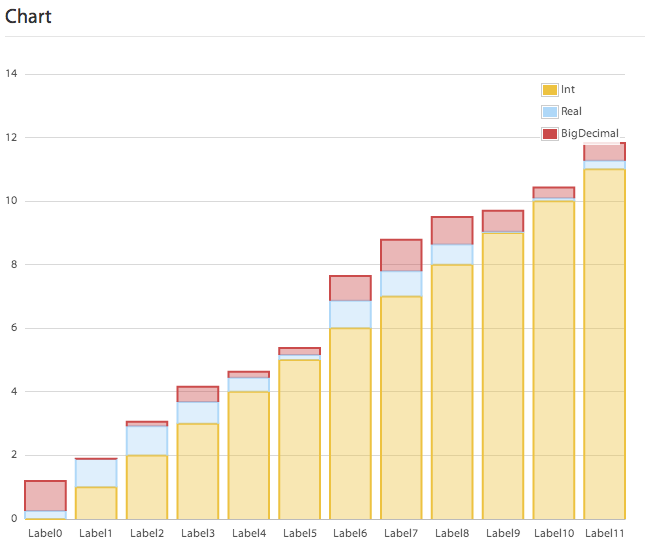
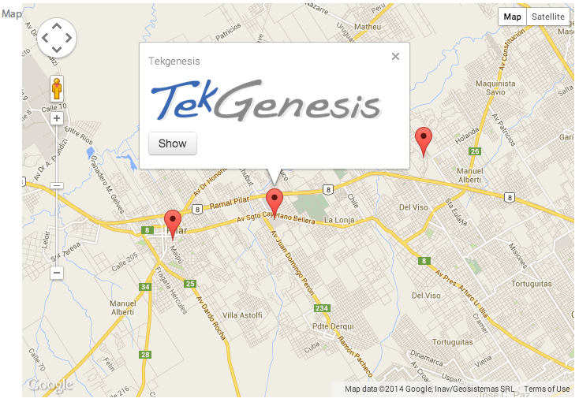
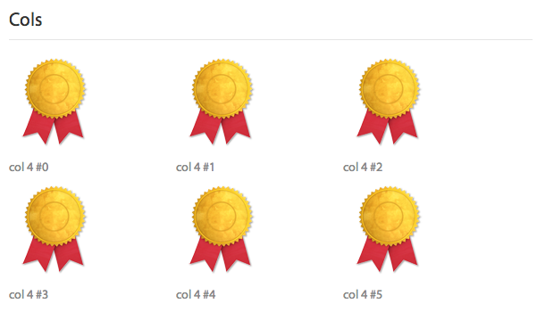

# Charts, Maps & Sections

Sui Generis Forms has within its extensive Widget's gallery three other multiple widgets besides the table, they are: chart, map and section. Here we are going to explain them further. As other multiples, each child widget in this multiple widgets will represent a column, but in this case the 'column' it's not visible. There are also some rules that apply to how the framework uses those columns in each particular widget. The goal is to explain all the differences here.

# Charts

They allow developers to display data to users in a fancier way. There are four supported chart types: *bar, line, column* and *pie.* The chart type is specified with an argument. Here is an example of a *column* chart:

**Code**

```
chartColumn "Chart" : chart(column), on_click click {
    key : internal;
    label : String;
    integer "Int" : Int;
    real "Real" : Real;
    bigDecimal "BigDecimal" : Decimal(5,2);
};
```

**Preview**



Here the enclosing fields are treated with the following rules:

* If widget is internal, it is ignored from the chart but the value can be used on on_clicks methods calls as a key of the row.
* The first String column will be used as the label of the row.
* All number columns (Real, Int or Decimal) will be treated as series and it's label will be used as the series label.

For charts, *on_click* method differs a little in its signature from other widgets *on_click* default signature. Lets look an example:

```java
@NotNull @Override public Action doClick(@NotNull Fields field) { ... }
```

It differs from others as it receives the series where the user has clicked. As series are represented by widgets, it receives the Fields enum value that represents it.

### Charts configuration

Chart widget supports configuration using the configuration API for widgets. It's covered at the [Widgets Configuration](../widgets_configuration.html) section, but here is a list of the things developers can configure:

* Series colors.
* Hoverability (and which info the hover dialog has).
* Show/hide legend.
* Show/hide axis.
* X axis label orientation.

### Live charts

With the combination of the model option *on_schedule*, developers can make charts that refresh themselves each given interval. For example: 

```
form SelfRefresheableChart "Self Refresheable Chart"
    on_schedule refresh 10
{
    sessions "Sessions" : chart(line) { sessionsCount : Int; };
    currentSessionOpened "Current sessions" : Int, display;
}
```

For example, here on the *load* method the chart starts plotting and on every call to the *refresh* method a row is added to the chart.

### Code Generation: table and row

The model for Charts are tables therefore, the generated code for them is the same one as the one generated for the tables. You can review it [here](../tables/tables.html#table-generated-code).

# Maps

They are used to show a map to the user. Different implementations can be used: *open_street, google, bing, unigis.* Choosing from between these types will change the look and feel of the map. Points that the map will show as markers can be given as a table of values. 
Supports only a structure with two childs that will be treated as Latitude and Longitude, and a third child, that must be a vertical group and will be used to render the legend that appears contextually to the marker, if the user clicks it. For example:

```
map "Map" : map {
    lat : Real;
    lng : Real;
    legend : vertical {
        title : String(20), display;
        img : image;
        button "Show": button, on_click show;
    };
};
```

Here *lat* and *lng* will represent the latitude and longitude of each marker that the map will render. The *legend* group will be rendered when the user clicks the marker. Any combination of widgets can be used here. This is how this map will look like: 



### Maps Configuration

Map widget supports configuration using the configuration API for widgets. It's covered at the [Widgets Configuration](../widgets_configuration.html) section, but here is a list of the things developers can configure:

* Center's point.
* Zoom level.
* Overlay: hybrid, roadmap (default), satellite, terrain are the possible options.

### Code Generation: table and row

The model for Charts are tables therefore, the generated code for them is the same one as the one generated for the tables. You can review it [here](../tables/tables.html#table-generated-code).

# Section

Sections work much like a table, repeating widgets, but instead of arranging them as rows with columns, each widget group inside the section gets repeated in a top-down row-alike layout.

```
some "Cols" : section {
	vertical, col 4 {
		colImg : String, image, style "no-label";
		displayText : display, style "no-label";
	};
};
```



lalalal
This 

section repeats the vertical group inside it, with the particularity that using the col attribute each row will get 3 repeatable groups. This is because the col attribute indicates how many columns of the 12 columns that all container has is filling. For instance, setting it to 4, you will get 3 spaces of a width of 4 columns, splitting the entire space in thirds. This idea is taking advantage of the Bootstrap CSS framework' grid system that Sui Generis Forms uses. For more on this, please review [Styling a form](../styling/styling_a_form.html) section or @inline(externalLinks.md#bootstrapgrid) documentation.


### Code Generation: table and row

The model for Charts are tables therefore, the generated code for them is the same one as the one generated for the tables. You can review it [here](../tables/tables.html#table-generated-code).


