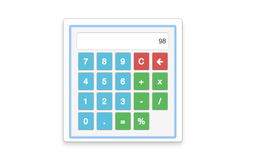

# ShortCuts

###  [Calculator 'c'](#calculator)

Allows the user to use a simple calculator. While focused on a TextField of type Number (Int, Real, Decimal), pressing **'c'** a calculator will appear in the middle of the screen for it's usage, if not without being focused in any widget pressing **'c'**.
 
To exit the calculator you could use either the key **ESC** or click everywhere outside the calculator. This will automatically update the widget that was focused (if you were focused on a  [TextField](../widgets/widgets.html#textfield) type Number) with the value in the calculator's display (if not zero).

The calculator can be used either with its buttons or with key shortcuts:

    - 0 to 9 . + - / x = % : make obvius and expected behaviour.
    - [ C ] : This will clear and reset everything from the calculator.
    - [ Backspace ] (left arrow button) : This will remove the last digit of the number in the display. In case there is one digit only, a zero will be displayed.
    - [ Q ] : appends two zeros to the displayed number (in case it isn't zero).
    - [ W ] : appends three zeros to the displayed number (in case it isn't zero).
    - [ _ ] : change sign to the number on the display.
    - [ M ] : insert the number in the display to memory
    - [ R ] : recover the number from memory to display
    - [ X ] : exchange the number in the display with the one in memory
    - [ L ] : cleans the number in memory
    - [ A ] : adds the number in the display to memory
    - [ S ] : subtracts the number in the display to memory
    - [ ! ] : makes factorial to the number in the display
