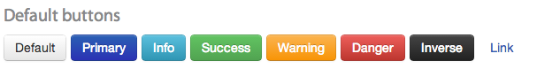

# Styles and Themes

In this section we are going to cover all the stuff related to styles and forms. In today's web, UI style is achieved using CSS (Cascading Style Sheets). In Sui Generis Forms, we use CSS to let developers style the forms.Forms are 100% compatible with @inline(externalLinks.md#bootstrap) CSS framework. That support means that widgets renders DOM that is compatible with Bootstrap. That also means that all Sui Generis generated forms are compatible with every Bootstrap theme available. They shipped with a default, nice and coherently designed theme but developers can easily switched it. Also, bootstrap classes are always loaded by default so that developers can use them to customise widgets.Throughout this section we will see how to switch a theme, how to add custom styles and an extensive list of example to see how some common style problems are resolved. We will also review the icon properties as they are an important part of styling widgets.This is how widgets styling looks like: 

```
buttonSuccess "Success" : button, content_style "btn-success form-align";
inputLarge "Input large"     : text_field, style "large";
```


# Themes

As we mentioned, Sui Generis Forms are compatible with @inline(externalLinks.md#bootstrap) framework. For those not familiar with it, Bootstrap, as its name indicates, serves a start point for a nice coherent looking web page. They described themselves as a *"Sleek, intuitive, and powerful front-end framework for faster and easier web development."*

In Sui Generis framework we use it as the default theming and styling tool. So Bootstrap's documentation is always a good point to start understanding how we think about styles and themes.

When you first load a form, you will see it 'dressing' the default Sui Generis theme. To switch it for a more convenient one for your needs, the only thing you have to do, is place a Bootstrap's compatible theme file called *theme.css* in the resource folder of your project. Now, the next time you load a form, it will use the projects theme instead of the default one. To look for alternatives, just google "bootstrap themes" and a lot of options both free and paid, will appear. We like the ones at @inline(externalLinks.md#bootswatch).

# Styles

Widgets have three [Field options](../forms.html#field-options) that are used to style them. We covered them at the Forms main page, but lets overlook them again:

|Option|Usage|Description|
|------|-----|-----------|
|**style** |style *"some-style"*|Sets the style class to the given String or to the expression's evaluation result. This class applies to the label / widget set.|
|**content_style** |content_style *"other-style"*|Sets the content style class to the given String or to the expression's evaluation result. This class applies typically to the widget.|
|**inline_style** |inline_style *"width: 100px"*|Sets an inline style to the given String or to the expression's evaluation result. This raw css applies typically to the widget.|

All the three are of String expression type. That means that they can received either an String constant or the result of the evaluation of a more complex String expression. That is useful when styles are dynamic, thous varying with some criteria. The first two, received an String that is interpreted as the name of a CSS class. As their description says, they provide two levels of styling. The last one, and less encouraged to be used, receives an String that is a piece of 'raw' hard-coded CSS style. This should be used only as a last resource option. Prefer using the first two when possible.

For the ones that references CSS classes, they are meant to be in a file called *style.css* inside the resource folder of your project. You can make the selectors with all the complexity you want. There are some rules that to look:

* We always insert your form inside a section with the id of the form, so you can use it as a scope to your styles.
* Also, widgets use their id in the generated DOM so you can use it to style them.
* Remember that all Bootstrap default classes are available by default, so don't duplicate them in your style.css file.
* Always use the Inspect Element feature of your browser if you have doubts where a style class gets inserted.

Always try to be clean and don't over add styles to your forms. You can also use frameworks like @inline(externalLinks.md#less)  that make your files more human readable. If your file ends with the *.less* extension instead of the default CSS one we process it for you first, and then serve it as regular CSS file.

# Icons

Widgets have two icon related [Field options](../forms.html#field-options). We also covered them at the Forms main page, but lets overlook them again:

|Option|Usage |Description|
|------|---------------------------------------------------------|-----------|
|**icon** |icon *"icon-check"*|Sets an icon over one of the predefined ones. Provides autocompletion over them. |
|**icon_expression** |icon_expression *expression*|Sets an icon to the expression's evaluation result. Use this for dynamic icons, for fixed icon, use *icon* instead.|

The first one lets developers add an icon, typically, in place, to a widget. They are predefined, so you have plugin's autocompletion of them when editing your form. As we use  @inline(externalLinks.md#fontAwsome) icons you can preview all the available options at their web page. For dynamic icons, that is icons that varies based on a condition, use the second field option listed on the table.

# Icons Examples

Lets see some examples:

### Button

```
syncButton "Synchronous Button" : button, icon refresh;
```


### Toggle button
 
```
togglebutton "ToggleButton" : toggle_button, icon square_o, icon_selected check_square_o, content_style "btn-large btn-info";
```

 

### Date Box

```
datebox "DateBox" : date_box, icon calendar;
```


### Text Field

```
apple "TexField" : text_field, icon apple;
```


# Style Showcase

In the following section we will introduce some examples showing how to achieve common things through styles.

### Default buttons

These are all the default buttons styles inherited from Bootstrap and how to achieve them in mm code.

```
buttons "Default buttons" : label, style "font-size-20";
horizontal, style "margin-top-10 margin-bottom-20" {
    buttonDefault "Default" : button, tooltip "default";
    buttonPrimary "Primary" : button, style "margin-left-5", content_style "btn-primary";
    buttonInfo    "Info"    : button, style "margin-left-5", content_style "btn-info";
    buttonSuccess "Success" : button, style "margin-left-5", content_style "btn-success";
    buttonWarning "Warning" : button, style "margin-left-5", content_style "btn-warning";
    buttonDanger  "Danger"  : button, style "margin-left-5", content_style "btn-danger";
    buttonInverse "Inverse" : button, style "margin-left-5", content_style "btn-inverse";
    buttonLink    "Link"    : button, style "margin-left-5", content_style "btn-link";
};
```



### Button sizes

These are all the default buttons sizes available and how to achieve them in mm code. They can be combined with the previous ones to achieve style/size variants.

```
buttonSizes "Button sizes" : label, style "font-size-20";
horizontal, style "margin-top-10 margin-bottom-20" {
    buttonLarge    "Large"   : button, content_style "btn-large";
    buttonDefault1 "Default" : button, style "margin-left-5";
    buttonSmall    "Small"   : button, style "margin-left-5", content_style "btn-small";
    buttonMini     "Mini"    : button, style "margin-left-5", content_style "btn-mini";
};
```


### Pulls: pull-left, pull-right

Forms are well aligned by default. But there some cases that you will want to 'break' that alignment. For that cases, *pull-right* and *pull-left* classes will achieved that.

```
pulls "Pulls: pull-left, pull-right" : label, style "font-size-20";
horizontal, style "margin-top-10 margin-bottom-20" {
    buttonR "Pulled right Button" : button, style "pull-right";
    buttonL "Pulled left Button" : button, style "pull-left";
};
```


### Input sizes

Input fields in forms gains its size from the type's length. But there some cases, that developers will need to override that behaviour. For that, Sui Generis forms provides a good range of input size classes.

```
inputSizes "Input sizes" : label, style "font-size-20";
vertical, style "margin-top-10 margin-bottom-20" {
    inputMini "Input mini" : text_field, style "mini";
    inputSmall "Input small" : text_field, style "small";
    inputMedium "Input medium" : text_field, style "medium";
    inputLarge "Input large" : text_field, style "large";
    inputXlarge "Input xlarge" : text_field, style "xlarge";
    inputXxlarge "Input xxlarge" : text_field, style "xxlarge";
    inputFull "Input full-width" : text_field, style "full-width";
};
```


### Margins

Again by default, widgets in forms tend to align properly. For that cases, where you want to make special widgets arrangements here we list all the default margin classes.

```
margins "Margins" : label, style "font-size-20";
vertical, style "margin-top-10 margin-bottom-20" {
    horizontal, style "margin-top-10 margin-bottom-20" {
        horizontal, style "border-1-dotted-gray" { marginLeft5  "Margin Left 5"  : button, style "margin-bottom-0 margin-left-5"; };
        horizontal, style "border-1-dotted-gray" { marginLeft10 "Margin Left 10" : button, style "margin-bottom-0 margin-left-10"; };
        horizontal, style "border-1-dotted-gray" { marginLeft20 "Margin Left 20" : button, style "margin-bottom-0 margin-left-20"; };
        horizontal, style "border-1-dotted-gray" { marginLeft30 "Margin Left 30" : button, style "margin-bottom-0 margin-left-30"; };
        horizontal, style "border-1-dotted-gray" { marginLeft40 "Margin Left 40" : button, style "margin-bottom-0 margin-left-40"; };
    };
    horizontal, style "margin-top-10 margin-bottom-20" {
        horizontal, style "border-1-dotted-gray" { marginRight5  "Margin Right 5"  : button, style "margin-bottom-0 margin-right-5"; };
        horizontal, style "border-1-dotted-gray" { marginRight10 "Margin Right 10" : button, style "margin-bottom-0 margin-right-10"; };
        horizontal, style "border-1-dotted-gray" { marginRight20 "Margin Right 20" : button, style "margin-bottom-0 margin-right-20"; };
        horizontal, style "border-1-dotted-gray" { marginRight30 "Margin Right 30" : button, style "margin-bottom-0 margin-right-30"; };
        horizontal, style "border-1-dotted-gray" { marginRight40 "Margin Right 40" : button, style "margin-bottom-0 margin-right-40"; };
    };
    horizontal, style "margin-top-10" {
        vertical {
            horizontal, style "border-1-dotted-gray" { marginTop5  "Margin Top 5"  : button, style "margin-bottom-0 margin-top-5"; };
            horizontal, style "border-1-dotted-gray" { marginTop10 "Margin Top 10" : button, style "margin-bottom-0 margin-top-10"; };
            horizontal, style "border-1-dotted-gray" { marginTop20 "Margin Top 20" : button, style "margin-bottom-0 margin-top-20"; };
            horizontal, style "border-1-dotted-gray" { marginTop30 "Margin Top 30" : button, style "margin-bottom-0 margin-top-30"; };
            horizontal, style "border-1-dotted-gray" { marginTop40 "Margin Top 40" : button, style "margin-bottom-0 margin-top-40"; };
        };
        vertical, style "margin-left-40" {
            horizontal, style "border-1-dotted-gray" { marginBottom5  "Margin Bottom 5"  : button, style "margin-bottom-5"; };
            horizontal, style "border-1-dotted-gray" { marginBottom10 "Margin Bottom 10" : button, style "margin-bottom-10";
            horizontal, style "border-1-dotted-gray" { marginBottom20 "Margin Bottom 20" : button, style "margin-bottom-20"; };
            horizontal, style "border-1-dotted-gray" { marginBottom30 "Margin Bottom 30" : button, style "margin-bottom-30"; };
            horizontal, style "border-1-dotted-gray" { marginBottom40 "Margin Bottom 40" : button, style "margin-bottom-40"; };
        };
        vertical, style "margin-left-40" {
            horizontal, style "border-1-dotted-gray" { margin5  "Margin 5"  : button, style "margin-5"; };
            horizontal, style "border-1-dotted-gray" { margin10 "Margin 10" : button, style "margin-10"; };
            horizontal, style "border-1-dotted-gray" { margin20 "Margin 20" : button, style "margin-20"; };
            horizontal, style "border-1-dotted-gray" { margin30 "Margin 30" : button, style "margin-30"; };
            horizontal, style "border-1-dotted-gray" { margin40 "Margin 40" : button, style "margin-40"; };
        };
    };
};
```


### Table

Tables look great by default, but here we list two classes, that can be used to change its look slightly. The first one, *table-condensed*, will make the rows in the table less taller. And the second one, *no-thead*, will hide the header of the table.

```
condensed "Table (style \"table-condensed\")" : label, style "font-size-20";
table : table, style "margin-top-10 margin-bottom-20 table-condensed" {
    firstName "First Name" : display;
    lastName "Last Name" : display;
    username "Username" : display;
};
noThead "Table (style \"no-thead\")" : label, style "font-size-20";
table1 : table, style "margin-top-10 margin-bottom-20 no-thead" {
    firstName1 "First Name" : display;
    lastName1 "Last Name" : display;
    username1 "Username" : display;
};
```


### Grids

Grids are an important part of the @inline(externalLinks.md#bootstrapgrid). As we support Bootstrap, that layout system can also be applied to forms. Here an example.
@todo update sample
```
grids "Grids (span-*)" : label, style "font-size-20";
horizontal, style "margin-top-10 margin-bottom-20" {
    more "More on this: " : label;
    bootLink "Bootstrap grid system" : label, link "http://getbootstrap.com", style "margin-left-5";
};
horizontal, style "margin-top-10 margin-bottom-20" {
    horizontal, style "label span1 center-middle" { l1 "1" : label; };
    horizontal, style "label span1 center-middle" { l2 "2" : label; };
    horizontal, style "label span1 center-middle" { l3 "3" : label; };
    horizontal, style "label span1 center-middle" { l4 "1" : label; };
    horizontal, style "label span1 center-middle" { l5 "1" : label; };
    horizontal, style "label span1 center-middle" { l6 "1" : label; };
    horizontal, style "label span1 center-middle" { l7 "1" : label; };
    horizontal, style "label span1 center-middle" { l8 "1" : label; };
    horizontal, style "label span1 center-middle" { l9 "1" : label; };
    horizontal, style "label span1 center-middle" { l10 "1" : label; };
    horizontal, style "label span1 center-middle" { l11 "1" : label; };
    horizontal, style "label span1 center-middle" { l12 "1" : label; };
};
horizontal, style "margin-top-10 margin-bottom-20" {
    horizontal, style "label span2 center-middle" { m1 "2" : label; };
    horizontal, style "label span2 center-middle" { m2 "2" : label; };
    horizontal, style "label span2 center-middle" { m3 "2" : label; };
    horizontal, style "label span2 center-middle" { m4 "2" : label; };
    horizontal, style "label span2 center-middle" { m5 "2" : label; };
    horizontal, style "label span2 center-middle" { m6 "2" : label; };
};
horizontal, style "margin-top-10 margin-bottom-20" {
    horizontal, style "label span3 center-middle" { n1 "3" : label; };
    horizontal, style "label span3 center-middle" { n2 "3" : label; };
    horizontal, style "label span3 center-middle" { n3 "3" : label; };
    horizontal, style "label span3 center-middle" { n4 "3" : label; };
};
horizontal, style "margin-top-10 margin-bottom-20" {
    horizontal, style "label span4 center-middle" { o1 "4" : label; };
    horizontal, style "label span4 center-middle" { o2 "4" : label; };
    horizontal, style "label span4 center-middle" { o3 "4" : label; };
};
horizontal, style "margin-top-10 margin-bottom-20" {
    horizontal, style "label span6 center-middle" { p1 "6" : label; };
    horizontal, style "label span6 center-middle" { p2 "6" : label; };
};
horizontal, style "margin-top-10 margin-bottom-20" {
    horizontal, style "label span12 center-middle" { q1 "12" : label; };
};
```


