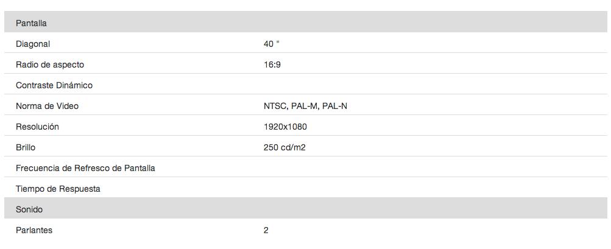
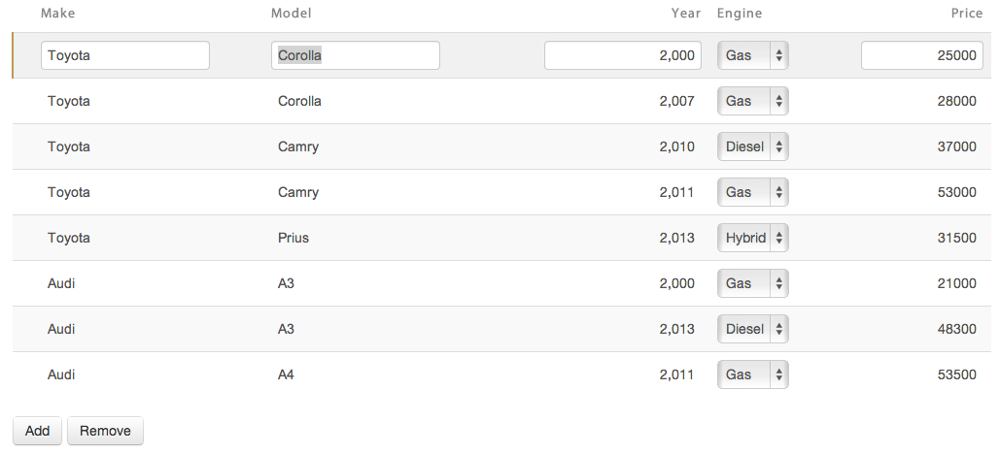

# Tables

In this section we are going to talk about one of the most used multiple widgets: the table. As seen in the Widget's section, tables are standard row / columns table. 
They can be used both for display or to display and edit data. 
If table is editable, it will only display widgets in edit mode, when the row is being edited. 
Basic table details have already been explained in the (widget)[../widgets/widgets.html#table] section, and Field Options in the (Field Options)[../forms.html#table]section.

Each child widget will represent a column. If you want more complex widget aggrupation, you can join them using groups. Internal columns are ignored in the UI but kept in the model, they are important if you want to have some context or state associated with the row. An example of a table can be:

**Code**

@inline-code(doc/samples/snippets/src/main/mm/tekgenesis/snippets/TableSnippets.mm#table)

**Preview**

When tables are rendered, they are static by default. That is they have a fixed number of rows (does not matter how many, but it's fixed). The rows are populated and the cardinality cannot be modified from the UI. If you want to let the user add or remove rows, there are specific button type to achieve that. That buttons code looks something like:
@inline-code(doc/samples/snippets/src/main/mm/tekgenesis/snippets/TableSnippets.mm#buttons)

You can add as many buttons as you need. Typically, if your table could grow large in rows, you would like to add buttons at the beginning and at the end of your table. If there is only one table in your form, all the *add_row* and *remove_row* buttons will operate over it. But, if you have more than one, your button will have to specified which table operates. In that case, your buttons will be specified like this:

@inline-code(doc/samples/snippets/src/main/mm/tekgenesis/snippets/TableSnippets.mm#buttonsWithId)

Tables in Sui Generis forms supports pagination. If your table can grow large in rows, and you don't need or want to display them all at the same time. 
To set how many rows you want per page, and activate pagination, you have to set an argument to your table like the following one:
@inline-code(doc/samples/snippets/src/main/mm/tekgenesis/snippets/TableSnippets.mm#tablePaged)

# Listing Tables

Tables can also be associated with an Entity. By doing that, there are some things that are resolved by default. For instance, if the row contains the key, the generated code will load all the instances available of that Entity by default. You can always overwrite it to filter instances by some criteria.
@inline-code(doc/samples/snippets/src/main/mm/tekgenesis/snippets/TableSnippets.mm#carTable)

Here we have a table of type Car. As this table has a type, each row will represent a Car. When the forms loads, it will invoke the *load* method, and all the Cars available will get loaded by default. All the table's columns are bounded to Car's attributes. The first column, is an internal one, representing the id of the currents row car. Internal columns are not visible to users, but they can be accessed programatically. In fact, the code in the *saveCar* method use it to update changes to cars upon leaving rows. Here, also, all columns will render default widgets by types. You can always override them with other of your choice. At last, by adding or removing rows using the buttons, cars will get added/removed from the database. This is a good example of how to manage instances of an Entity using a table. 

This listing, is such a common case that an abbreviation exists:

**Code**
@inline-code(doc/samples/snippets/src/main/mm/tekgenesis/snippets/TableSnippets.mm#carListing)

This is known as listing form of an Entity, in this case, Car. It expresses the table listing in a more concise way.

**Preview**

# Table Generated Code

Each table's model responds to an interface accessible through its getter in the Forms's generated code. With it, developers can add/remove rows, retrieve a particular row by its index, clear the table, know if it has a current selected row and get it, sort the table and alter its pagination. Here is the complete list of methods:

@inline-code(runtime/web/src/main/java/tekgenesis/form/FormTable.java)

# Table Row Generated Code

Tables generates code to represent their rows. Using that API developers can make a lot of tasks programmatically. These are the generated methods:

@inline-code(doc/samples/snippets/src_managed/main/mm/tekgenesis/snippets/PagedTableFormBase.java?class SimpleValuesRowBase)
