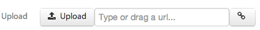
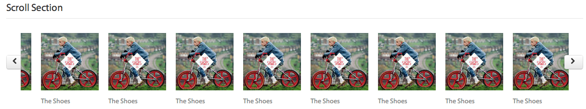
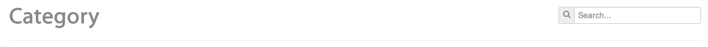

# Widgets
 
The following are all the widgets and panels available in Sui Generis forms library. Here you will have an overview with sample code and available field options for all of them.

**[Simple](#simple)**

[Anchor](#anchor) | [Breadcrumb](#breadcrumb) | [Button](#button) | [CheckBox](#checkbox) | [CheckBoxGroup](#checkboxgroup) | [ColorPicker](#colorpicker) | [ComboBox](#combobox) | [ComboDateBox](#combodatebox) | [DateBox](#datebox) | [DatePicker](#datepicker) | [DateTimeBox](#datetimebox) | [Display](#display) | [DoubleDateBox](#doubledatebox) | [Dynamic](#dynamic) | [Gallery](#gallery) | [IFrame](#iframe) | [Image](#image) | [Internal](#internal) | [Label](#label) | [ListBox](#listbox) | [MailField](#mailfield)  | [Message](#message) | [PasswordField](#passwordfield) | [PickList](#picklist) | [Progress](#progress) | [RadioGroup](#radiogroup) | [Rating](#rating) | [RichTextArea](#richtextarea) | [SearchBox](#searchbox) | [Showcase](#showcase) | [SuggestBox](#suggestbox) | [Tags](#tags) | [TagsComboBox](#tagscombobox) | [TagsSuggestBox](#tagssuggestbox) | [TextArea](#textarea) | [TextField](#textfield) | [TimePicker](#timepicker) | [ToggleButton](#togglebutton) | [Upload](#upload) | [Video](#video)

**[Multiples](#multiples)**

[Table](#table) | [Chart](#chart) | [Map](#map) | [Section](#section)

**[Groups](#groups)**

[Dialog](#dialog) | [Dropdown](#dropdown) | [Footer](#footer) | [Header](#header) | [Horizontal](#horizontal) | [InputGroup](#inputgroup) | [Popover](#popover) | [Tabs](#tabs) | [Subform](#subform) | [Vertical](#vertical)

##Simple
### Anchor

Defines a placeholder on the form that can be used to insert a subform. The subform refers  to the anchor using the 'on' field option.

**Value in the model:** *None.*

**Code**
@inline-code(doc/samples/doc-project/src/main/mm/tekgenesis/doc/Samples.mm#anchor)

**Available field options:** *None.* @todo, can not be none ... hay q forma de deducirlas y no escribirlas de a una??

### Breadcrumb

List of structured links. Useful to show paths and navigation in hierarchical structures.

**Value in the model:** *List<String>.*

**Code**
@inline-code(doc/samples/doc-project/src/main/mm/tekgenesis/doc/Samples.mm#breadcrumb)

**Preview**
 

**Available field options:** 

[required](../forms.html#required) | [optional](../forms.html#optional) | [default](../forms.html#default) | [is](../forms.html#is) | [check](../forms.html#check) | [skip_tab](../forms.html#skip_tab) | [disable](../forms.html#disable) | [hide](../forms.html#hide) | [reset](../forms.html#reset) | [depends_on](../forms.html#depends_on) | [on_change](../forms.html#on_change) | [on_ui_change](../forms.html#on_ui_change) | [on_blur](../forms.html#on_blur) | [unique](../forms.html#unique) | [placeholder](../forms.html#placeholder) | [hint](../forms.html#hint) | [tooltip](../forms.html#tooltip) | [label_expression](../forms.html#label_expression) | [style](../forms.html#style) | [content_style](../forms.html#content_style) | [inline_style](../forms.html#inline_style) | [shortcut](../forms.html#shortcut) | [hide_column](../forms.html#hide_column)

### Button

Visual element that triggers an event, invokes associated on_click method when user clicks it.
This widget accept a [button_type](../forms.html#button_type) argument.

**Value in the model:** *None.*

**Code**
@inline-code(doc/samples/doc-project/src/main/mm/tekgenesis/doc/Samples.mm#buttons)

**Preview**
 

**Available field options:** 

[on_click](../forms.html#on_click) | [confirm](../forms.html#confirm) | [synchronous](../forms.html#synchronous) | [disable](../forms.html#disable) | [hide](../forms.html#hide) | [depends_on](../forms.html#depends_on) | [on_blur](../forms.html#on_blur) | [hint](../forms.html#hint) | [tooltip](../forms.html#tooltip) | [label_expression](../forms.html#label_expression) | [style](../forms.html#style) | [content_style](../forms.html#content_style) | [inline_style](../forms.html#inline_style) | [shortcut](../forms.html#shortcut) | [icon](../forms.html#icon) | [icon_expression](../forms.html#icon_expression) | [hide_column](../forms.html#hide_column)

### CheckBox

Permits the user to make a binary choice, i.e. a choice between one of two possible options, typically yes/no choices.

**Value in the model:** *Boolean.*

**Code**
@inline-code(doc/samples/doc-project/src/main/mm/tekgenesis/doc/Samples.mm#check_box)

**Preview**
 

**Available field options:** 

[required](../forms.html#required) | [optional](../forms.html#optional) | [default](../forms.html#default) | [is](../forms.html#is) | [check](../forms.html#check) | [skip_tab](../forms.html#skip_tab) | [disable](../forms.html#disable) | [hide](../forms.html#hide) | [reset](../forms.html#reset) | [depends_on](../forms.html#depends_on) | [on_change](../forms.html#on_change) | [on_ui_change](../forms.html#on_ui_change) | [on_blur](../forms.html#on_blur) | [unique](../forms.html#unique) | [placeholder](../forms.html#placeholder) | [hint](../forms.html#hint) | [tooltip](../forms.html#tooltip) | [label_expression](../forms.html#label_expression) | [style](../forms.html#style) | [content_style](../forms.html#content_style) | [inline_style](../forms.html#inline_style) | [shortcut](../forms.html#shortcut) | [hide_column](../forms.html#hide_column)

### CheckBoxGroup

Allows the user to select many of a list of options. This list is presented as a group of check boxes.

**Value in the model:** *List<Any>. Typically an Enum.*

**Code**
@inline-code(doc/samples/doc-project/src/main/mm/tekgenesis/doc/Samples.mm#check_box_group)

**Preview**
 

**Available field options:** 

[required](../forms.html#required) | [optional](../forms.html#optional) | [default](../forms.html#default) | [is](../forms.html#is) | [check](../forms.html#check) | [skip_tab](../forms.html#skip_tab) | [disable](../forms.html#disable) | [hide](../forms.html#hide) | [reset](../forms.html#reset) | [depends_on](../forms.html#depends_on) | [on_change](../forms.html#on_change) | [on_ui_change](../forms.html#on_ui_change) | [on_blur](../forms.html#on_blur) | [unique](../forms.html#unique) | [placeholder](../forms.html#placeholder) | [hint](../forms.html#hint) | [tooltip](../forms.html#tooltip) | [label_expression](../forms.html#label_expression) | [style](../forms.html#style) | [content_style](../forms.html#content_style) | [inline_style](../forms.html#inline_style) | [shortcut](../forms.html#shortcut) | [hide_column](../forms.html#hide_column)

### ColorPicker

Shows a list of colors to choose one of them.

**Value in the model:** *String. Representing HEX color.*

**Code**
@inline-code(doc/samples/doc-project/src/main/mm/tekgenesis/doc/Samples.mm#color_picker)

**Preview**
 

**Available field options:** 

[required](../forms.html#required) | [optional](../forms.html#optional) | [default](../forms.html#default) | [is](../forms.html#is) | [check](../forms.html#check) | [skip_tab](../forms.html#skip_tab) | [disable](../forms.html#disable) | [hide](../forms.html#hide) | [reset](../forms.html#reset) | [depends_on](../forms.html#depends_on) | [on_change](../forms.html#on_change) | [on_ui_change](../forms.html#on_ui_change) | [on_blur](../forms.html#on_blur) | [unique](../forms.html#unique) | [hint](../forms.html#hint) | [tooltip](../forms.html#tooltip) | [label_expression](../forms.html#label_expression) | [style](../forms.html#style) | [content_style](../forms.html#content_style) | [inline_style](../forms.html#inline_style) | [shortcut](../forms.html#shortcut) | [hide_column](../forms.html#hide_column)

### ComboBox

Allows the user to select one of a list of options. This list is presented as a standard combo box.

**Value in the model:** *Any. Useful with Enums.*

**Code**
@inline-code(doc/samples/doc-project/src/main/mm/tekgenesis/doc/Samples.mm#combo)

**Preview**
 

**Available field options:** 

[required](../forms.html#required) | [optional](../forms.html#optional) | [default](../forms.html#default) | [is](../forms.html#is) | [custom_mask](../forms.html#custom_mask) | [mask](../forms.html#mask) | [input_mask](../forms.html#input_mask) | [check](../forms.html#check) | [skip_tab](../forms.html#skip_tab) | [disable](../forms.html#disable) | [hide](../forms.html#hide) | [reset](../forms.html#reset) | [depends_on](../forms.html#depends_on) | [on_change](../forms.html#on_change) | [on_ui_change](../forms.html#on_ui_change) | [on_blur](../forms.html#on_blur) | [unique](../forms.html#unique) | [hint](../forms.html#hint) | [tooltip](../forms.html#tooltip) | [label_expression](../forms.html#label_expression) | [style](../forms.html#style) | [content_style](../forms.html#content_style) | [inline_style](../forms.html#inline_style) | [shortcut](../forms.html#shortcut) | [hide_column](../forms.html#hide_column)

### ComboDateBox

Permits user to enter a date using three combos (month, day, year).

**Value in the model:** *DateOnly.*

**Code**
@inline-code(doc/samples/doc-project/src/main/mm/tekgenesis/doc/Samples.mm#combo_date_box)

**Preview**
 

**Available field options:** 

[from](../forms.html#from) | [to](../forms.html#to) | [required](../forms.html#required) | [optional](../forms.html#optional) | [default](../forms.html#default) | [is](../forms.html#is) | [check](../forms.html#check) | [skip_tab](../forms.html#skip_tab) | [disable](../forms.html#disable) | [hide](../forms.html#hide) | [reset](../forms.html#reset) | [depends_on](../forms.html#depends_on) | [on_change](../forms.html#on_change) | [on_ui_change](../forms.html#on_ui_change) | [on_blur](../forms.html#on_blur) | [unique](../forms.html#unique) | [hint](../forms.html#hint) | [tooltip](../forms.html#tooltip) | [label_expression](../forms.html#label_expression) | [style](../forms.html#style) | [content_style](../forms.html#content_style) | [inline_style](../forms.html#inline_style) | [shortcut](../forms.html#shortcut) | [hide_column](../forms.html#hide_column)

### DateBox

Also permits a user to enter a date but using a calendar that shows when user clicks the date_box. Also allows the user to type a date using a format that is based on the locale.

Supports key shortcuts to navigate through it: ⌘ + ↑ (Previous week), ⌘ + ↓ (Next week), ⌘ + → (Next day), ⌘ + ← (Previous day), ⌘ + Shift + → (Next year) and ⌘ + Shift + ← (Previous year).

**Value in the model:** *DateOnly.*

**Code**
@inline-code(doc/samples/doc-project/src/main/mm/tekgenesis/doc/Samples.mm#date_box)

**Preview**
 

**Available field options:** 

[date_type](../forms.html#date_type) | [from](../forms.html#from) | [to](../forms.html#to)[ | required](../forms.html#required) | [optional](../forms.html#optional) | [default](../forms.html#default) | [is](../forms.html#is) | [check](../forms.html#check) | [skip_tab](../forms.html#skip_tab) | [disable](../forms.html#disable) | [hide](../forms.html#hide) | [reset](../forms.html#reset) | [depends_on](../forms.html#depends_on) | [on_change](../forms.html#on_change) | [on_ui_change](../forms.html#on_ui_change) | [on_blur](../forms.html#on_blur) | [unique](../forms.html#unique) | [hint](../forms.html#hint) | [tooltip](../forms.html#tooltip) | [label_expression](../forms.html#label_expression) | [style](../forms.html#style) | [content_style](../forms.html#content_style) | [inline_style](../forms.html#inline_style) | [shortcut](../forms.html#shortcut) | [icon](../forms.html#icon) | [icon_expression](../forms.html#icon_expression) | [hide_column](../forms.html#hide_column)

### DatePicker

Also permits a user to enter a date but using a only an embedded calendar. Supports same shortcuts as the DateBox.

**Value in the model:** *DateOnly.*

**Code**
@inline-code(doc/samples/doc-project/src/main/mm/tekgenesis/doc/Samples.mm#date_picker)

**Preview**
 

**Available field options:** 

[from](../forms.html#from) | [to](../forms.html#to) | [required](../forms.html#required) | [optional](../forms.html#optional) | [default](../forms.html#default) | [is](../forms.html#is) | [check](../forms.html#check) | [skip_tab](../forms.html#skip_tab) | [disable](../forms.html#disable) | [hide](../forms.html#hide) | [reset](../forms.html#reset) | [depends_on](../forms.html#depends_on) | [on_change](../forms.html#on_change) | [on_ui_change](../forms.html#on_ui_change) | [on_blur](../forms.html#on_blur) | [unique](../forms.html#unique) | [hint](../forms.html#hint) | [tooltip](../forms.html#tooltip) | [label_expression](../forms.html#label_expression) | [style](../forms.html#style) | [content_style](../forms.html#content_style) | [inline_style](../forms.html#inline_style) | [shortcut](../forms.html#shortcut) | [hide_column](../forms.html#hide_column)

### DateTimeBox

Permits the user to enter a date and time. Supports same shortcuts as the DateBox.

**Value in the model:** *DateTime.*

**Code**
@inline-code(doc/samples/doc-project/src/main/mm/tekgenesis/doc/Samples.mm#date_time_box)

**Preview**
 

**Available field options:** 

[date_type](../forms.html#date_type) | [From](../forms.html#from) | [midnight_as_24](../forms.html#midnight_as_24) | [reset_time](../forms.html#reset_time) | [from](../forms.html#from) | [to](../forms.html#to) | [required](../forms.html#required) | [optional](../forms.html#optional) | [default](../forms.html#default) | [is](../forms.html#is) | [check](../forms.html#check) | [skip_tab](../forms.html#skip_tab) | [disable](../forms.html#disable) | [hide](../forms.html#hide) | [reset](../forms.html#reset) | [depends_on](../forms.html#depends_on) | [on_change](../forms.html#on_change) | [on_ui_change](../forms.html#on_ui_change) | [on_blur](../forms.html#on_blur) | [unique](../forms.html#unique) | [hint](../forms.html#hint) | [tooltip](../forms.html#tooltip) | [label_expression](../forms.html#label_expression) | [style](../forms.html#style) | [content_style](../forms.html#content_style) | [inline_style](../forms.html#inline_style) | [shortcut](../forms.html#shortcut) | [icon](../forms.html#icon) | [icon_expression](../forms.html#icon_expression) | [hide_column](../forms.html#hide_column)

### Display

Shows a pair of label / value. The value is read-only an uses type aware formatting. Also with the link field_option useful to display links.

**Value in the model:** *Any or List<Any> (with multiple specified).*

**Code**
@inline-code(doc/samples/doc-project/src/main/mm/tekgenesis/doc/Samples.mm#display)

**Preview**
 

**Available field options:** 

[required](../forms.html#required) | [optional](../forms.html#optional) | [default](../forms.html#default) | [is](../forms.html#is) | [multiple](../forms.html#multiple) | [check](../forms.html#check) | [skip_tab](../forms.html#skip_tab) | [disable](../forms.html#disable) | [hide](../forms.html#hide) | [reset](../forms.html#reset) | [depends_on](../forms.html#depends_on) | [on_change](../forms.html#on_change) | [on_click](../forms.html#on_click) | [on_blur](../forms.html#on_blur) | [unique](../forms.html#unique) | [hint](../forms.html#hint) | [tooltip](../forms.html#tooltip) | [label_expression](../forms.html#label_expression) | [style](../forms.html#style) | [content_style](../forms.html#content_style) | [inline_style](../forms.html#inline_style) | [shortcut](../forms.html#shortcut) | [icon](../forms.html#icon) | [icon_expression](../forms.html#icon_expression) | [hide_column](../forms.html#hide_column) | [custom_mask](../forms.html#custom_mask) | [mask](../forms.html#mask) | [input_mask ](../forms.html#input_mask)| [link](../forms.html#link)[ |](../forms.html#input_mask) [link_form](../forms.html#link_form) | [link_pk](../forms.html#link_pk) | [target_blank](../forms.html#target_blank) | [synchronous](../forms.html#synchronous) | [text_length](../forms.html#text_length) | [draggable](../forms.html#draggable)

### DoubleDateBox

Similar to DateBox but showing two calendars instead of one.

**Value in the model:** *DateOnly.*

**Code**
@inline-code(doc/samples/doc-project/src/main/mm/tekgenesis/doc/Samples.mm#double_date_box)

**Preview**
 **

**Available field options:** 

[date_type](../forms.html#date_type) | [from](../forms.html#from) | [to](../forms.html#to) | [required](../forms.html#required) | [optional](../forms.html#optional) | [default](../forms.html#default) | [is](../forms.html#is) | [check](../forms.html#check) | [skip_tab](../forms.html#skip_tab) | [disable](../forms.html#disable) | [hide](../forms.html#hide) | [reset](../forms.html#reset) | [depends_on](../forms.html#depends_on) | [on_change](../forms.html#on_change) | [on_ui_change](../forms.html#on_ui_change) | [on_blur](../forms.html#on_blur) | [unique](../forms.html#unique) | [hint](../forms.html#hint) | [tooltip](../forms.html#tooltip) |  [label_expression](../forms.html#label_expression) | [style](../forms.html#style) | [content_style](../forms.html#content_style) | [inline_style](../forms.html#inline_style) | [shortcut](../forms.html#shortcut) | [icon](../forms.html#icon) | [icon_expression](../forms.html#icon_expression) | [hide_column](../forms.html#hide_column)

### Dynamic

Widget that mutate its widget UI to match the default one based on value type.

**Value in the model:** *Any.*

**Code**
@inline-code(doc/samples/doc-project/src/main/mm/tekgenesis/doc/Samples.mm#dynamic)

**Available field options:** 

[required](../forms.html#required) | [optional](../forms.html#optional) | [default](../forms.html#default) | [is](../forms.html#is) | [multiple](../forms.html#multiple) | [check](../forms.html#check) | [skip_tab](../forms.html#skip_tab) | [disable](../forms.html#disable) | [hide](../forms.html#hide) | [reset](../forms.html#reset) | [depends_on](../forms.html#depends_on) | [on_change](../forms.html#on_change) | [on_ui_change](../forms.html#on_ui_change) | [on_blur](../forms.html#on_blur) | [unique](../forms.html#unique) | [hint](../forms.html#hint) | [tooltip](../forms.html#tooltip) | [label_expression](../forms.html#label_expression) | [style](../forms.html#style) | [content_style](../forms.html#content_style) | [inline_style](../forms.html#inline_style) | [shortcut](../forms.html#shortcut) | [icon](../forms.html#icon) | [icon_expression](../forms.html#icon_expression) | [hide_column](../forms.html#hide_column) | [filtering](../forms.html#filtering)

### Gallery

Presents a gallery of images with thumbnails which are clickable to display the full image in a dialog.

**Value in the model:** *List<String*>* (for links) or List<Resource>.*

**Code**
@inline-code(doc/samples/doc-project/src/main/mm/tekgenesis/doc/Samples.mm#gallery)

**Preview**
 

**Available field options:** 

[required](../forms.html#required) | [optional](../forms.html#optional) | [default](../forms.html#default) | [is](../forms.html#is) | [multiple](../forms.html#multiple) | [check](../forms.html#check) | [skip_tab](../forms.html#skip_tab) | [disable](../forms.html#disable) | [hide](../forms.html#hide) | [reset](../forms.html#reset) | [depends_on](../forms.html#depends_on) | [on_change](../forms.html#on_change) | [on_ui_change](../forms.html#on_ui_change) | [on_blur](../forms.html#on_blur) | [unique](../forms.html#unique) | [hint](../forms.html#hint) | [tooltip](../forms.html#tooltip) | [label_expression](../forms.html#label_expression) | [style](../forms.html#style) | [content_style](../forms.html#content_style) | [inline_style](../forms.html#inline_style) | [shortcut](../forms.html#shortcut) | [hide_column](../forms.html#hide_column)

### IFrame

**Value in the model:** String 

**Code**
@inline-code(samples/showcase/src/main/mm/tekgenesis/showcase/IFrameShowCase.mm#iframe)

**Preview**
 

**Available field options:** 
[style](../forms.html#style) | [content_style](../forms.html#content_style) | [inline_style](../forms.html#inline_style) | [hide](../forms.html#hide) | col 

### Image

Displays an Image represented by a String (URL) or a Resource.

**Value in the model:** String or Resource

**Code**
@inline-code(doc/samples/doc-project/src/main/mm/tekgenesis/doc/Samples.mm#image)

**Preview**
 

**Available field options:** 

[required](../forms.html#required) | [optional](../forms.html#optional) | [default](../forms.html#default) | [is](../forms.html#is) | [multiple](../forms.html#multiple) | [check](../forms.html#check) | [skip_tab](../forms.html#skip_tab) | [disable](../forms.html#disable) | [hide](../forms.html#hide) | [reset](../forms.html#reset) | [depends_on](../forms.html#depends_on) | [on_change](../forms.html#on_change) | [on_ui_change](../forms.html#on_ui_change) | [on_blur](../forms.html#on_blur) | [unique](../forms.html#unique) | [hint](../forms.html#hint) | [tooltip](../forms.html#tooltip) | [label_expression](../forms.html#label_expression) | [style](../forms.html#style) | [content_style](../forms.html#content_style) | [inline_style](../forms.html#inline_style) | [shortcut](../forms.html#shortcut) | [hide_column](../forms.html#hide_column)

### Internal

Represents a value slot in the model BUT does not have a UI representation. Useful for represent state, ids, codes, etc.

**Value in the model:** *Any or List<Any>*

**Code**
@inline-code(doc/samples/doc-project/src/main/mm/tekgenesis/doc/Samples.mm#internal)

**Available field options:** 

[required](../forms.html#required) | [optional](../forms.html#optional) | [default](../forms.html#default) | [is](../forms.html#is) | [multiple](../forms.html#multiple) | [on_change](../forms.html#on_change)

### Label

Shows only a label of text. Useful for headings or to put label to rare combination of widgets as it gets aligned as all labels are aligned in forms. 

**Value in the model:** *None.*

**Code**
@inline-code(doc/samples/doc-project/src/main/mm/tekgenesis/doc/Samples.mm#label)

**Preview**
 

**Available field options:** 

[hide](../forms.html#hide) | [reset](../forms.html#reset) | [hint](../forms.html#hint) | [tooltip](../forms.html#tooltip) | [label_expression](../forms.html#label_expression) | [style](../forms.html#style) | [content_style](../forms.html#content_style) | [inline_style](../forms.html#inline_style) | [shortcut](../forms.html#shortcut) | [icon](../forms.html#icon) | [icon_expression](../forms.html#icon_expression) | [hide_column](../forms.html#hide_column) | [link](../forms.html#link) | [link_form](../forms.html#link_form) | [link_pk](../forms.html#link_pk) | [target_blank](../forms.html#target_blank) | [confirm](../forms.html#confirm) | [on_click](../forms.html#on_click) | [tooltip](../forms.html#tooltip) | [synchronous](../forms.html#synchronous)

### ListBox

Displays a list (multi-select or not) of options to choose from. Visible elements are controlled by an int argument.

**Value in the model:** *Any.* Options: *Iterable<Any>.*

**Code**
@inline-code(doc/samples/doc-project/src/main/mm/tekgenesis/doc/Samples.mm#list_box)

**Preview**
 **

**Available field options:**  

[rows](../forms.html#rows) | [multiple](../forms.html#multiple) | [required](../forms.html#required) | [optional](../forms.html#optional) | [default](../forms.html#default) | [is](../forms.html#is) | [custom_mask](../forms.html#custom_mask) | [mask](../forms.html#mask) | [input_mask](../forms.html#input_mask) | [check](../forms.html#check) | [skip_tab](../forms.html#skip_tab) | [disable](../forms.html#disable) | [hide](../forms.html#hide) | [reset](../forms.html#reset) | [depends_on](../forms.html#depends_on) | [on_change](../forms.html#on_change) | [on_ui_change](../forms.html#on_ui_change) | [on_blur](../forms.html#on_blur) | [unique](../forms.html#unique) | [hint](../forms.html#hint) | [tooltip](../forms.html#tooltip) | [label_expression](../forms.html#label_expression) | [style](../forms.html#style) | [content_style](../forms.html#content_style) | [inline_style](../forms.html#inline_style) | [shortcut](../forms.html#shortcut) | [hide_column](../forms.html#hide_column)

### MailField

Presents an input text field but as user types, once he types '@' different mail domains are suggested.
There are a series of domains suggested by default that are the most used mailboxes. If the suggested options are to be changed, a set-Field-Options generated method must be called, passing a list of String, being the domains. 
On blur, the email address in the input text will be validated (the syntax and the domain).

MailField can receive a parameter indicating which validation to make (syntax, domain, address, syntax_domain). If no parameter is declared then it will make all validations.
Syntax will validate the syntax of the address.
Domain will validate that the domain really exists and its valid.
Address will validate that the address in fact exist, after validating that the domain exists too.
Syntax_domain will validate syntax and domain only, it wont check for the address. 

There is a property that enables or disables the address validation dynamically. This property can be changed in the Sui Generis console. In the Configurations form in the console, "Properties" tab must be selected and then search the property that is called "forms.mailValidatorEnabled" setting true or false according to how you want all MailFields to behave.

**Value in the model:** *String.*

**Code**
@inline-code(doc/samples/doc-project/src/main/mm/tekgenesis/doc/Samples.mm#mail)

For more details see [Mail Report Sample](../../samples/mailReport.html)
**Preview**
 
**Preview**
 
 
**Available field options:**

[on_suggest](../forms.html#on_suggest) | [on_suggest_sync](../forms.html#on_suggest_sync) | [required](../forms.html#required) | [optional](../forms.html#optional) | [default](../forms.html#default) | [is](../forms.html#is) | [check](../forms.html#check) | [disable](../forms.html#disable) | [hide](../forms.html#hide) | [reset](../forms.html#reset) | [depends_on](../forms.html#depends_on) | [on_change](../forms.html#on_change) | [on_ui_change](../forms.html#on_ui_change) | [hint](../forms.html#hint) | [tooltip](../forms.html#tooltip) | [placeholder](../forms.html#placeholder) | [label_expression](../forms.html#label_expression) | [style](../forms.html#style) | [content_style](../forms.html#content_style) | [inline_style](../forms.html#inline_style) | [icon](../forms.html#icon) | [icon_expression](../forms.html#icon_expression)

### Message

Shows a message to the user. Messages uses field label as a message title and value as the message itself. Also style can be changed by specifying one of the available style/severities as argument: ERROR, WARNING, INFO, SUCCESS, PLAIN, TITLE. When set to title alone, message displays the title of the actual form, useful for form heading.

**Value in the model:** *String.*

**Code**
@inline-code(doc/samples/doc-project/src/main/mm/tekgenesis/doc/Samples.mm#message)

**Preview**
 

**Available field options:**

[text_length](../forms.html#text_length) | [default](../forms.html#default) | [is](../forms.html#is) | [skip_tab](../forms.html#skip_tab) | [disable](../forms.html#disable) | [hide](../forms.html#hide) | [reset](../forms.html#reset) | [depends_on](../forms.html#depends_on) | [on_change](../forms.html#on_change) | [on_ui_change](../forms.html#on_ui_change) | [on_blur](../forms.html#on_blur) | [unique](../forms.html#unique) | [hint](../forms.html#hint) | [tooltip](../forms.html#tooltip) | [label_expression](../forms.html#label_expression) | [style](../forms.html#style) | [content_style](../forms.html#content_style) | [inline_style](../forms.html#inline_style) | [shortcut](../forms.html#shortcut) | [icon](../forms.html#icon) | [icon_expression](../forms.html#icon_expression) | [hide_column](../forms.html#hide_column)

### PasswordField

Presents an input text field but as user types, what user is typing gets replaced with dots. Useful for password fields.

**Value in the model:** *String.*

**Code**
@inline-code(doc/samples/doc-project/src/main/mm/tekgenesis/doc/Samples.mm#password_field)

**Preview**
 **

**Available field options:**

[required](../forms.html#required) | [optional](../forms.html#optional) | [default](../forms.html#default) | [is](../forms.html#is) | [skip_tab](../forms.html#skip_tab) | [check](../forms.html#check) | [disable](../forms.html#disable) | [hide](../forms.html#hide) | [reset](../forms.html#reset) | [depends_on](../forms.html#depends_on) | [on_change](../forms.html#on_change) | [on_ui_change](../forms.html#on_ui_change) | [on_blur](../forms.html#on_blur) | [unique](../forms.html#unique) | [hint](../forms.html#hint) | [tooltip](../forms.html#tooltip) | [placeholder](../forms.html#placeholder) | [label_expression](../forms.html#label_expression) |  [style](../forms.html#style) | [content_style](../forms.html#content_style) | [inline_style](../forms.html#inline_style) | [shortcut](../forms.html#shortcut) | [icon](../forms.html#icon) | [icon_expression](../forms.html#icon_expression) | [hide_column](../forms.html#hide_column)

### PickList

Presents a list of values on a list on the left. Users can select between them by choosing them and clicking on the first button. Users can also deselect them by selecting them on the list on the right and clicking on the second button.

**Value in the model:** *Any. Useful with Enums.*

**Code**
@inline-code(doc/samples/doc-project/src/main/mm/tekgenesis/doc/Samples.mm#pick_list)

**Preview**
 

**Available field options:** 

[required](../forms.html#required) | [optional](../forms.html#optional) | [default](../forms.html#default) | [is](../forms.html#is) | [custom_mask](../forms.html#custom_mask) | [mask](../forms.html#mask) | [input_mask](../forms.html#input_mask) | [check](../forms.html#check) | [skip_tab](../forms.html#skip_tab) | [disable](../forms.html#disable) | [hide](../forms.html#hide) | [reset](../forms.html#reset) | [depends_on](../forms.html#depends_on) | [on_change](../forms.html#on_change) | [on_ui_change](../forms.html#on_ui_change) | [on_blur](../forms.html#on_blur) | [unique](../forms.html#unique) | [hint](../forms.html#hint) | [tooltip](../forms.html#tooltip) | [label_expression](../forms.html#label_expression) | [style](../forms.html#style) | [content_style](../forms.html#content_style) | [inline_style](../forms.html#inline_style) | [shortcut](../forms.html#shortcut) | [hide_column](../forms.html#hide_column)

### Progress

Shows a progress bar.

**Value in the model:** *Real.*

**Code**
@inline-code(doc/samples/doc-project/src/main/mm/tekgenesis/doc/Samples.mm#progress)

**Preview**
 

**Available field options:**

[required](../forms.html#required) | [optional](../forms.html#optional) | [default](../forms.html#default) | [is](../forms.html#is) | [skip_tab](../forms.html#skip_tab) | [check](../forms.html#check) | [disable](../forms.html#disable) | [hide](../forms.html#hide) | [reset](../forms.html#reset) | [depends_on](../forms.html#depends_on) | [on_change](../forms.html#on_change) | [on_ui_change](../forms.html#on_ui_change) | [on_blur](../forms.html#on_blur) | [unique](../forms.html#unique) | [hint](../forms.html#hint) | [tooltip](../forms.html#tooltip) | [placeholder](../forms.html#placeholder) | [label_expression](../forms.html#label_expression) | [style](../forms.html#style) | [content_style](../forms.html#content_style) | [inline_style](../forms.html#inline_style) | [shortcut](../forms.html#shortcut) | [hide_column](../forms.html#hide_column)

### RadioGroup

Allows the user to select one of a list of options. This list is presented as a group of radio groups.

**Value in the model:** *Any. Typically an Enum.*

**Code**
@inline-code(doc/samples/doc-project/src/main/mm/tekgenesis/doc/Samples.mm#radio_group)

**Preview**
 

**Available field options:**

### Rating

Allows the user to rate selecting one of a list of options. This list is presented as a group icons just as stars or hearts.

**Value in the model:** *Int. Typically it's from 1 to n.*

**Code**
@inline-code(doc/samples/doc-project/src/main/mm/tekgenesis/doc/Samples.mm#rating)

**Preview**
 

**Available field options:**

[required](../forms.html#required)| [optional](../forms.html#optional) | [default](../forms.html#default)| [is](../forms.html#is) | [skip_tab](../forms.html#skip_tab) | [check](../forms.html#check) | [disable](../forms.html#disable) | [hide](../forms.html#hide) | [reset](../forms.html#reset) | [depends_on](../forms.html#depends_on) | [on_change](../forms.html#on_change) | [on_ui_change](../forms.html#on_ui_change) | [hint](../forms.html#hint) | [tooltip](../forms.html#tooltip) | [label_expression](../forms.html#label_expression) | [style](../forms.html#style) | [content_style](../forms.html#content_style) | [inline_style](../forms.html#inline_style) | [hide_column](../forms.html#hide_column)

### RichTextArea

Text area that allow user to style the text entered using a toolbar with plenty of common style options.

**Value in the model:** *String.*

**Code**
@inline-code(doc/samples/doc-project/src/main/mm/tekgenesis/doc/Samples.mm#rich_text_area)

**Preview**
 **

**Available field options:**

[required](../forms.html#required) | [optional](../forms.html#optional) | [default](../forms.html#default)| [is](../forms.html#is) | [skip_tab](../forms.html#skip_tab) | [check](../forms.html#check) | [disable](../forms.html#disable) | [hide](../forms.html#hide) | [reset](../forms.html#reset) | [depends_on](../forms.html#depends_on) | [on_change](../forms.html#on_change) | [on_ui_change](../forms.html#on_ui_change) | [on_blur](../forms.html#on_blur) | [unique](../forms.html#unique) | [hint](../forms.html#hint) | [tooltip](../forms.html#tooltip) | [placeholder](../forms.html#placeholder) | [label_expression](../forms.html#label_expression) | [style](../forms.html#style) | [content_style](../forms.html#content_style) | [inline_style](../forms.html#inline_style) | [shortcut](../forms.html#shortcut) | [hide_column](../forms.html#hide_column)

### SearchBox

Allows users to search over the created instances of an entity. When selecting one the form will load it. Also if user has handle_deprecated permission, it allows to select to search over the deprecated also.

**Value in the model:** *String, EntityRef.* 

**Code**
@inline-code(doc/samples/doc-project/src/main/mm/tekgenesis/doc/Samples.mm#search_box)

**Preview**
 

**Available field options:**

[required](../forms.html#required) | [optional](../forms.html#optional) | [default](../forms.html#default)| [is](../forms.html#is) | [skip_tab](../forms.html#skip_tab) | [check](../forms.html#check) | [disable](../forms.html#disable) | [hide](../forms.html#hide) | [reset](../forms.html#reset) | [depends_on](../forms.html#depends_on) | [on_change](../forms.html#on_change) | [on_ui_change](../forms.html#on_ui_change) | [on_blur](../forms.html#on_blur) | [unique](../forms.html#unique) | [hint](../forms.html#hint) | [tooltip](../forms.html#tooltip) | [placeholder](../forms.html#placeholder) | [label_expression](../forms.html#label_expression) | [style](../forms.html#style) | [content_style](../forms.html#content_style) | [inline_style](../forms.html#inline_style) | [shortcut](../forms.html#shortcut) | [icon](../forms.html#icon) | [icon_expression](../forms.html#icon_expression) | [hide_column](../forms.html#hide_column) | [filter](../forms.html#filter) | [on_suggest](../forms.html#on_suggest) | [on_suggest_sync](../forms.html#on_suggest_sync) | [on_new](../forms.html#on_new) | [on_new_form](../forms.html#on_new_form) | [change_delay](../forms.html#change_delay) | [change_threshold](../forms.html#change_threshold) | [query_mode](../forms.html#query_mode)

### Showcase

Displays the usual main image and mini thumbnails widget. When users clicks or hovers over a thumbnail, the image representing the thumbnail gets loaded as main image.

**Value in the model:** *List<Resource>.*

**Code**
@inline-code(doc/samples/doc-project/src/main/mm/tekgenesis/doc/Samples.mm#showcase)

**Preview**
 **

**Available field options:**

[required](../forms.html#required) | [optional](../forms.html#optional) | [default](../forms.html#default) | [is](../forms.html#is) | [skip_tab](../forms.html#skip_tab) | [check](../forms.html#check) | [disable](../forms.html#disable) | [hide](../forms.html#hide) | [reset](../forms.html#reset) | [depends_on](../forms.html#depends_on) | [on_change](../forms.html#on_change) | [on_ui_change](../forms.html#on_ui_change) | [on_blur](../forms.html#on_blur) | [unique](../forms.html#unique) | [hint](../forms.html#hint) | [tooltip](../forms.html#tooltip) | [placeholder](../forms.html#placeholder) | [label_expression](../forms.html#label_expression) | [style](../forms.html#style) | [content_style](../forms.html#content_style) | [inline_style](../forms.html#inline_style) | [shortcut](../forms.html#shortcut) | [hide_column](../forms.html#hide_column)

### SuggestBox

Lets the user search freely over a universe of suggestions. Suggestion might come from all the instances of an Entity or from the result of the invocation to a method that returns them.

**Value in the model:** *EntityRef, String or Enum.*

**Code**
@inline-code(doc/samples/doc-project/src/main/mm/tekgenesis/doc/Samples.mm#suggest_box)

**Preview**
 **

**Available field options:**

[filter](../forms.html#filter) | [on_suggest](../forms.html#on_suggest) | [on_suggest_sync](../forms.html#on_suggest_sync) | [on_new](../forms.html#on_new) | [on_new_form](../forms.html#on_new_form) | [change_delay](../forms.html#change_delay) | [change_threshold](../forms.html#change_threshold) | [query_mode](../forms.html#query_mode) | [required](../forms.html#required) | [optional](../forms.html#optional) | [default](../forms.html#default) | [is](../forms.html#is) | [skip_tab](../forms.html#skip_tab) | [check](../forms.html#check) | [disable](../forms.html#disable) | [hide](../forms.html#hide) | [reset](../forms.html#reset) | [depends_on](../forms.html#depends_on) | [on_change](../forms.html#on_change) | [on_ui_change](../forms.html#on_ui_change) | [on_blur](../forms.html#on_blur) | [unique](../forms.html#unique) | [hint](../forms.html#hint) | [tooltip](../forms.html#tooltip) | [placeholder](../forms.html#placeholder) | [label_expression](../forms.html#label_expression) | [style](../forms.html#style) | [content_style](../forms.html#content_style) | [inline_style](../forms.html#inline_style) | [shortcut](../forms.html#shortcut) | [icon](../forms.html#icon) | [icon_expression](../forms.html#icon_expression) | [hide_column](../forms.html#hide_column)

### Tags

Allows user to type text freely, when Enter is hit the text gets transformed to a tag and user can start adding a new tag.

**Value in the model:** *List<String>.*

**Code**
@inline-code(doc/samples/doc-project/src/main/mm/tekgenesis/doc/Samples.mm#tags)

**Preview**
 **

**Available field options:**  

[multiple](../forms.html#multiple) | [required](../forms.html#required) | [optional](../forms.html#optional) | [default](../forms.html#default)| [is](../forms.html#is) | [check](../forms.html#check) | [skip_tab](../forms.html#skip_tab) | [disable](../forms.html#disable) | [hide](../forms.html#hide) | [reset](../forms.html#reset) | [depends_on](../forms.html#depends_on) | [on_change](../forms.html#on_change) | [on_ui_change](../forms.html#on_ui_change) | [on_blur](../forms.html#on_blur) | [unique](../forms.html#unique) | [hint](../forms.html#hint) | [tooltip](../forms.html#tooltip) | [label_expression](../forms.html#label_expression) | [style](../forms.html#style) | [content_style](../forms.html#content_style) | [inline_style](../forms.html#inline_style) | [shortcut](../forms.html#shortcut) | [hide_column](../forms.html#hide_column)

### TagsComboBox

Similar to a ComboBox but selected options are showed as tags.

**Value in the model:** *List<String>, List<Enum>*, List<EntityRef>*.*

**Code**
@inline-code(doc/samples/doc-project/src/main/mm/tekgenesis/doc/Samples.mm#tags_combo_box)

**Preview**
 **

**Available field options:**  

[required](../forms.html#required) | [optional](../forms.html#optional) | [default](../forms.html#default) | [is](../forms.html#is) | [check](../forms.html#check) | [skip_tab](../forms.html#skip_tab) | [disable](../forms.html#disable) | [hide](../forms.html#hide) | [reset](../forms.html#reset) | [depends_on](../forms.html#depends_on) | [on_change](../forms.html#on_change) | [on_ui_change](../forms.html#on_ui_change) | [on_blur](../forms.html#on_blur) | [unique](../forms.html#unique) | [hint](../forms.html#hint) | [tooltip](../forms.html#tooltip) | [label_expression](../forms.html#label_expression) | [style](../forms.html#style) | [content_style](../forms.html#content_style) | [inline_style](../forms.html#inline_style) | [shortcut](../forms.html#shortcut) | [icon](../forms.html#icon) | [icon_expression](../forms.html#icon_expression) | [hide_column](../forms.html#hide_column)

### TagsSuggestBox

Combination of a suggest_box and tags component. Users can add tags based on suggestions.

**Value in the model:** *List<String>, List<EntityRef>, List<Enum>.*

**Code**
@inline-code(doc/samples/doc-project/src/main/mm/tekgenesis/doc/Samples.mm#tags_suggest_box)

**Preview**
 **

**Available field options:**

[filter](../forms.html#filter) | [on_suggest](../forms.html#on_suggest) | [on_suggest_sync](../forms.html#on_suggest_sync) | [on_new](../forms.html#on_new) | [on_new_form](../forms.html#on_new_form) | [change_delay](../forms.html#change_delay) | [change_threshold](../forms.html#change_threshold) | [query_mode](../forms.html#query_mode) | [required](../forms.html#required) | [optional](../forms.html#optional) | [default](../forms.html#default) | [is](../forms.html#is) | [skip_tab](../forms.html#skip_tab) | [check](../forms.html#check) | [disable](../forms.html#disable) | [hide](../forms.html#hide) | [reset](../forms.html#reset) | [depends_on](../forms.html#depends_on) | [on_change](../forms.html#on_change) | [on_ui_change](../forms.html#on_ui_change) | [on_blur](../forms.html#on_blur) | [unique](../forms.html#unique) | [hint](../forms.html#hint) | [tooltip](../forms.html#tooltip) | [placeholder](../forms.html#placeholder) | [label_expression](../forms.html#label_expression) | [style](../forms.html#style) | [content_style](../forms.html#content_style) | [inline_style](../forms.html#inline_style) | [shortcut](../forms.html#shortcut) | [hide_column](../forms.html#hide_column)

### TextArea

Multi-line text field. Users can enter text freely. Rows and columns are controlled via arguments. If not specified, length is taken from the type's precision.

**Value in the model:** *String.*

**Code**
@inline-code(doc/samples/doc-project/src/main/mm/tekgenesis/doc/Samples.mm#text_area)

**Preview**
 

**Available field options:** 

[rows](../forms.html#rows) | [length](../forms.html#length) | [required](../forms.html#required) | [optional](../forms.html#optional) | [default](../forms.html#default) | [is](../forms.html#is) | [custom_mask](../forms.html#custom_mask) | [mask](../forms.html#mask) | [input_mask](../forms.html#input_mask) | [check](../forms.html#check) | [skip_tab](../forms.html#skip_tab) | [disable](../forms.html#disable) | [hide](../forms.html#hide) | [reset](../forms.html#reset) | [depends_on](../forms.html#depends_on) | [on_change](../forms.html#on_change) | [on_ui_change](../forms.html#on_ui_change) | [on_blur](../forms.html#on_blur) | [unique](../forms.html#unique) | [hint](../forms.html#hint) | [tooltip](../forms.html#tooltip) | [label_expression](../forms.html#label_expression) | [style](../forms.html#style) | [content_style](../forms.html#content_style) | [inline_style](../forms.html#inline_style) | [shortcut](../forms.html#shortcut) | [hide_column](../forms.html#hide_column)

### TextField

Common free text field. If not specified, length is taken from the type's precision. It also validates on the fly for numeric types and does proper alignment and punctuation of them.

**Value in the model:** *String, Int, Real.*

**Code**
@inline-code(doc/samples/doc-project/src/main/mm/tekgenesis/doc/Samples.mm#text_field)

**Preview**
 **

Those TextFields whose value in the model is of type Number (Int, Real, Decimal) have the option of using a [Calculator](../shortcuts/shortcuts.html#calculator) widget.

**Available field options:** 

[length](../forms.html#length) | [required](../forms.html#required) | [optional](../forms.html#optional) | [default](../forms.html#default) | [is](../forms.html#is) | [custom_mask](../forms.html#custom_mask) | [mask](../forms.html#mask) | [input_mask](../forms.html#input_mask) | [check](../forms.html#check) | [skip_tab](../forms.html#skip_tab) | [disable](../forms.html#disable) | [hide](../forms.html#hide) | [reset](../forms.html#reset) | [depends_on](../forms.html#depends_on) | [on_change](../forms.html#on_change) | [on_ui_change](../forms.html#on_ui_change) | [on_blur](../forms.html#on_blur) | [unique](../forms.html#unique) | [hint](../forms.html#hint) | [tooltip](../forms.html#tooltip) | [label_expression](../forms.html#label_expression) | [style](../forms.html#style) | [content_style](../forms.html#content_style) | [inline_style](../forms.html#inline_style) | [shortcut](../forms.html#shortcut) | [icon](../forms.html#icon) | [icon_expression](../forms.html#icon_expression) | [hide_column](../forms.html#hide_column) | [no_paste](../forms.html#no_paste)

### TimePicker

Allows to select an hour of the day using to combos to represent hours and minutes. From, to and step are valid to restrict options.

**Value in the model:** *Int (seconds from 00:00).*

**Code**
@inline-code(doc/samples/doc-project/src/main/mm/tekgenesis/doc/Samples.mm#time_picker)

**Preview**
 **

**Available field options:** 

[from](../forms.html#from) | [to](../forms.html#to) | [required](../forms.html#required) | [optional](../forms.html#optional) | [default](../forms.html#default) | [is](../forms.html#is) | [check](../forms.html#check) | [skip_tab](../forms.html#skip_tab) | [disable](../forms.html#disable) | [hide](../forms.html#hide) | [reset](../forms.html#reset) | [depends_on](../forms.html#depends_on) | [on_change](../forms.html#on_change) | [on_ui_change](../forms.html#on_ui_change) | [on_blur](../forms.html#on_blur) | [unique](../forms.html#unique) | [hint](../forms.html#hint) | [tooltip](../forms.html#tooltip) | [label_expression](../forms.html#label_expression) | [style](../forms.html#style) | [content_style](../forms.html#content_style) | [inline_style](../forms.html#inline_style) | [shortcut](../forms.html#shortcut) | [hide_column](../forms.html#hide_column) | step | [midnight_as_24](../forms.html#midnight_as_24)

### ToggleButton

Two-state (pressed-not pressed) button.

**Value in the model:** *Boolean.*

**Code**
@inline-code(doc/samples/doc-project/src/main/mm/tekgenesis/doc/Samples.mm#toggle_button)

**Preview**
 **

**Available field options:** 

[on_change](../forms.html#on_change) | [confirm](../forms.html#confirm) | [synchronous](../forms.html#synchronous) | [skip_tab](../forms.html#skip_tab) | [disable](../forms.html#disable) | [hide](../forms.html#hide) | [depends_on](../forms.html#depends_on) | [on_blur](../forms.html#on_blur) | [placeholder](../forms.html#placeholder) | [hint](../forms.html#hint) | [tooltip](../forms.html#tooltip) | [label_expression](../forms.html#label_expression) | [style](../forms.html#style) | [content_style](../forms.html#content_style) | [inline_style](../forms.html#inline_style) | [shortcut](../forms.html#shortcut) | [icon](../forms.html#icon) | [icon_expression](../forms.html#icon_expression) | [hide_column](../forms.html#hide_column) | [icon_selected](../forms.html#icon_selected) | [synchronous](../forms.html#synchronous)

### Upload

Presents the user an upload field for the user to choose a file to upload. Files can be filter by mime type and also can be dragged from outside the browser.

**Value in the model:** *List<Resource>.*

**Code**
@inline-code(doc/samples/doc-project/src/main/mm/tekgenesis/doc/Samples.mm#upload)

**Preview**
 **

**Available field options:** 

[file_type](../forms.html#file_type) | [multiple](../forms.html#multiple) | [required](../forms.html#required) | [optional](../forms.html#optional) | [default](../forms.html#default) | [is](../forms.html#is) | [check](../forms.html#check) | [skip_tab](../forms.html#skip_tab) | [disable](../forms.html#disable) | [hide](../forms.html#hide) | [reset](../forms.html#reset) | [depends_on](../forms.html#depends_on) | [on_change](../forms.html#on_change) | [on_ui_change](../forms.html#on_ui_change) | [on_blur](../forms.html#on_blur) | [unique](../forms.html#unique) | [hint](../forms.html#hint) | [tooltip](../forms.html#tooltip) | [label_expression](../forms.html#label_expression) | [style](../forms.html#style) | [content_style](../forms.html#content_style) | [inline_style](../forms.html#inline_style) | [shortcut](../forms.html#shortcut) | [hide_column](../forms.html#hide_column) | [camera](../forms.html#camera)

### Video

Presents a video player.

**Value in the model:** *String.*

**Code**
@inline-code(doc/samples/doc-project/src/main/mm/tekgenesis/doc/Samples.mm#video)

**Preview**
 **

**Available field options:** 

[required](../forms.html#required) | [optional](../forms.html#optional) | [default](../forms.html#default) | [is](../forms.html#is) | [multiple](../forms.html#multiple) | [check](../forms.html#check) | [skip_tab](../forms.html#skip_tab) | [disable](../forms.html#disable) | [hide](../forms.html#hide) | [reset](../forms.html#reset) | [depends_on](../forms.html#depends_on) | [on_change](../forms.html#on_change) | [on_ui_change](../forms.html#on_ui_change) | [on_blur](../forms.html#on_blur) | [unique](../forms.html#unique) | [hint](../forms.html#hint) | [tooltip](../forms.html#tooltip) | [label_expression](../forms.html#label_expression) | [style](../forms.html#style) | [content_style](../forms.html#content_style) | [inline_style](../forms.html#inline_style) | [shortcut](../forms.html#shortcut) | [hide_column](../forms.html#hide_column)

# Multiples

### Table

Standard row / columns table. Each child widget will represent a column. Also groups can be used to group more than a widget per column. Internal columns are ignored from the UI but remain at the model. To see more about Tables, there is an entire section [here](../tables/tables.html).

**Code**
@inline-code(doc/samples/doc-project/src/main/mm/tekgenesis/doc/Samples.mm#table)

**Preview**
 

**Available field options:**
See (Field Options)[../forms.html#table] section in forms documentation.
[on_change](../forms.html#on_change) | [on_ui_change](../forms.html#on_ui_change) | [on_blur](../forms.html#on_blur) | [row_style](../forms.html#row_style) | [sortable](../forms.html#sortable) | [on_selection](../forms.html#on_selection) | [draggable](../forms.html#draggable) | [filtering](../forms.html#filtering) | [col](../forms.html#col) | [style](../forms.html#style) | [content_style](../forms.html#content_style) | [inline_style](../forms.html#inline_style) | [on_click](../forms.html#on_click) | [on_load](../forms.html#on_load)

### Chart

Presents data as a chart. Supported chart types are: *bar, line, column and pie.* To see more about charts, they are extensively covered [here](../other_multiples/other_multiples.html#charts).

**Code**
@inline-code(doc/samples/doc-project/src/main/mm/tekgenesis/doc/Samples.mm#chart)

**Preview**
 

**Available field options:**

[chart_type](../forms.html#chart_type) | [on_click](../forms.html#on_click)

### Map

Shows a map. Different implementations can be used: *open_street (default), google, bing, unigis. *Map points can be given as a table of values. Supports only two child, one will be treated as Latitude and the other one as Longitude. To see more about maps, they are extensively covered [here](../other_multiples/other_multiples.html#maps).

**Code**
@inline-code(doc/samples/doc-project/src/main/mm/tekgenesis/doc/Samples.mm#map)

**Preview**
 

**Available field options:**

[map_type](../forms.html#map_type) | [draggable](../forms.html#draggable) | [on_change](../forms.html#on_change) | [on_ui_change](../forms.html#on_ui_change) | [on_blur](../forms.html#on_blur)

### Section

Section that repeats itself vertically by default. Combinations of groups and styles con make grids. To see more about section, they are extensively covered [here](../other_multiples/other_multiples.html#section). If scrollable is set, presents handlers to move horizontally and supports mouse scroll.

**Code**
@inline-code(doc/samples/doc-project/src/main/mm/tekgenesis/doc/Samples.mm#section)

**Preview**
 

**Preview**
 

**Available field options:**

[on_change](../forms.html#on_change) | [on_ui_change](../forms.html#on_ui_change) | [on_blur](../forms.html#on_blur) | [row_style](../forms.html#row_style) | [filtering](../forms.html#filtering) | col | [style](../forms.html#style) | [content_style](../forms.html#content_style) | [inline_style](../forms.html#inline_style) | [scrollable](../forms.html#scrollable)

### Groups

All group widgets act as container of their child widgets.

### Dialog

Creates a trigger (a link by default) to open a dialog that will contain all the child widgets.

**Value in the model:** *Boolean. (meaning open or close)*

**Code**
@inline-code(doc/samples/doc-project/src/main/mm/tekgenesis/doc/Samples.mm#dialog)

**Preview**
 

**Available field options:**

[display](../forms.html#display)

### Dropdown

Renders all its children as items of a dropdown menu. With the 'split' option, the first child gets rendered besides the handler that opens the dropdown (outside the dropdown menu).

**Value in the model:** *None.*

**Code**
@inline-code(doc/samples/doc-project/src/main/mm/tekgenesis/doc/Samples.mm#dropdown)

**Preview**
 **

**Available field options:**

[disable](../forms.html#disable) | [hide](../forms.html#hide) | [icon](../forms.html#icon) | [icon_expression](../forms.html#icon_expression) | [style](../forms.html#style) | [content_style](../forms.html#content_style) | [inline_style](../forms.html#inline_style) | [split](../forms.html#split)

### Footer

Special horizontal group on the form that act as a marker of what widgets are in the footer of the form. Also it gets styled different by default. It gets generated by default with the following structure but can be modified.

**Value in the model:** *None.*

**Code**
@inline-code(doc/samples/doc-project/src/main/mm/tekgenesis/doc/Samples.mm#footer)

**Preview**
 

**Available field options:**

[style](../forms.html#style) | [content_style](../forms.html#content_style) | [inline_style](../forms.html#inline_style)

### Header

Special horizontal group on the form that act as a marker of what widgets are in the header of the form. Also it gets styled different by default. It gets generated by default with the following structure but can be modified.

**Value in the model:** *None.*

**Code**
@inline-code(doc/samples/doc-project/src/main/mm/tekgenesis/doc/Samples.mm#header)

**Preview**
 

**Available field options:**

[style](../forms.html#style) | [content_style](../forms.html#content_style) | [inline_style](../forms.html#inline_style)

### Horizontal

Widgets in horizontal groups are rendered one beside the other with 0px margin within them.

**Value in the model:** *Boolean. (if collapsible its set)*

**Code**
@inline-code(doc/samples/doc-project/src/main/mm/tekgenesis/doc/Samples.mm#horizontal)

**Preview**
 

**Available field options:**

[style](../forms.html#style) | [content_style](../forms.html#content_style) | [inline_style](../forms.html#inline_style) | [hide](../forms.html#hide) | col | [collapsible](../forms.html#collapsible) | [affix](../forms.html#affix)

### InputGroup

Widgets in an InputGroup are rendered one beside the other following the grid system, their labels are ignored.

**Value in the model:** *None.*

**Code**
@inline-code(doc/samples/doc-project/src/main/mm/tekgenesis/doc/Samples.mm#input_group)

**Preview**
 

**Available field options:**

[style](../forms.html#style) | [content_style](../forms.html#content_style) | [inline_style](../forms.html#inline_style) | [hide](../forms.html#hide) | col 

### Popover

Creates a trigger that upon click opens a pop-up over the trigger. Label its used as the title in the header of the popover. Supports footer.

**Value in the model:** *Boolean (open or close).*

**Code**
@inline-code(doc/samples/doc-project/src/main/mm/tekgenesis/doc/Samples.mm#popover)

**Preview**
 **

**Available field options:**

[icon](../forms.html#icon) | [icon_expression](../forms.html#icon_expression) | [style](../forms.html#style) | [content_style](../forms.html#content_style) | [inline_style](../forms.html#inline_style) | [hover](../forms.html#hover) | [icon_selected](../forms.html#icon_selected) | [display](../forms.html#display)

### Tabs

Renders each vertical group as a tab using its label as the tab label. Tabs can be *top(default), left, right, bottom or pill*.

**Value in the model:** *Int (index of the selected tab).*

**Code**
@inline-code(doc/samples/doc-project/src/main/mm/tekgenesis/doc/Samples.mm#tabs)

**Preview**
 **

**Available field options:**

[icon](../forms.html#icon) | [icon_expression](../forms.html#icon_expression) | [style](../forms.html#style) | [content_style](../forms.html#content_style) | [inline_style](../forms.html#inline_style) | [hover](../forms.html#hover) | [icon_selected](../forms.html#icon_selected) | [display](../forms.html#display)

### Subform

 Enables reuse of forms. Creates a trigger (a link which text can be modified with the 'display' option) on the parent form that will open the subform. Subforms can be opened as a dialog or at an anchor specified somewhere on the parent form.

**Value in the model:** *FormInstance.*

**Code**
@inline-code(doc/samples/doc-project/src/main/mm/tekgenesis/doc/Samples.mm#subform)

|On anchor|Dialog|
|---------|------|
|**Preview** |**Preview** |

**Available field options:**

[on](../forms.html#on) | [display](../forms.html#display) | [required](../forms.html#required) | [optional](../forms.html#optional) | [disable](../forms.html#disable) | [hide](../forms.html#hide) | [icon](../forms.html#icon) | [icon_expression](../forms.html#icon_expression) | [depends_on](../forms.html#depends_on)

### Vertical

Widgets in vertical groups are rendered one below the other with 0px margin within them.

**Value in the model:** *Boolean. (if collapsible its set)*

**Code**
@inline-code(doc/samples/doc-project/src/main/mm/tekgenesis/doc/Samples.mm#vertical)

**Preview**
 

**Available field options:**

[style](../forms.html#style) | [content_style](../forms.html#content_style) | [inline_style](../forms.html#inline_style) | [hide](../forms.html#hide) | col | [collapsible](../forms.html#collapsible) | [affix](../forms.html#affix)
