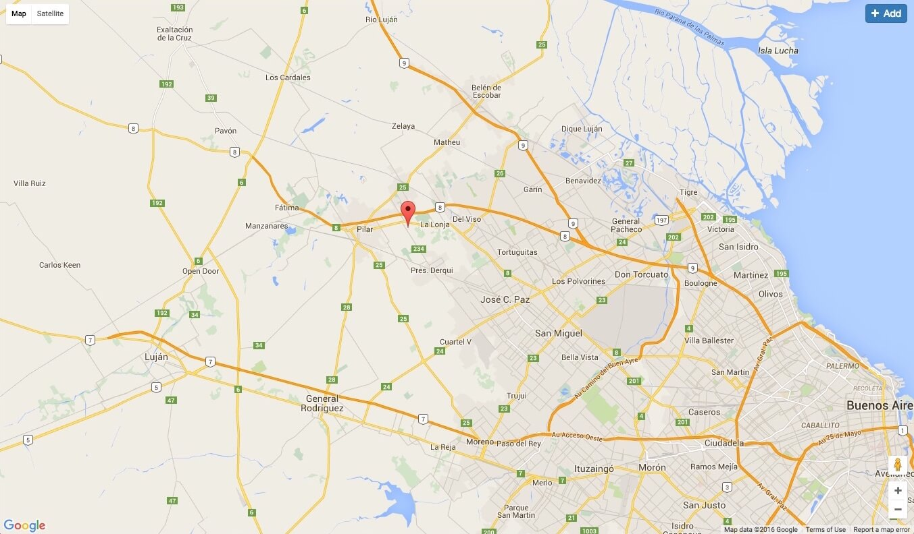
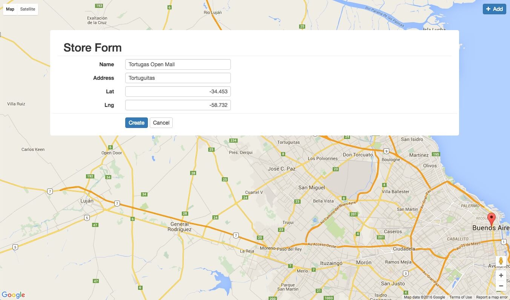

# Map Web Example

We are going to create a simple web app to create Stores and show them in a map.

 
## Store Entity

A Store has a name and address and a location represented by latitude and longitude attributes. 

@inline-code(samples/basic/src/main/mm/tekgenesis/sales/basic/Store.mm#storeEntity)

## Store Form

Simple form to create Stores.
@inline-code(samples/basic/src/main/mm/tekgenesis/sales/basic/Store.mm#storeForm)

The form java class. 
The create, update and cancel methods will return an Action with a javascript invocation. 
We will use this invocations later to know when we need to refresh the html page.  

@inline-code(samples/basic/src/main/java/tekgenesis/sales/basic/StoreForm.java)

## REST API

Create a REST Api to fetch a Store info by its key.
@inline-code(samples/basic/src/main/mm/tekgenesis/sales/basic/Store.mm#storeServiceHandler)
@inline-code(samples/basic/src/main/mm/tekgenesis/sales/basic/Store.mm#storeType)

When invoking the route '/service/store/$key' a JSON representing a StoreType will be returned.

@inline-code(samples/basic/src/main/java/tekgenesis/sales/basic/StoreServiceHandler.java#getKey)
@inline-code(samples/basic/src/main/java/tekgenesis/sales/basic/StoreServiceHandler.java#toStoreType)

## Html pages

Here is the page template.mustache holding the app template for all html pages. 
(You can see the provided Built-in Custom Tags [here](../mustache.html))
It will receive the page title and the Html content body.  

@inline-code(samples/basic/src/main/resources/html/store/template.mustache)

Page stores.mustache holding a map that will show a map with all the available stores, and a form box that will include the StoreForm.
@inline-code(samples/basic/src/main/resources/html/store/stores.mustache)

## Html Routes

Create a new url entry '/stores' that returns the stores html page. 
@inline-code(samples/basic/src/main/mm/tekgenesis/sales/basic/Store.mm#storeHtmlHandler)

Implementation of StoreHtmlHandler.
The home method will return the html page.

@inline-code(samples/basic/src/main/java/tekgenesis/sales/basic/StoreHtmlHandler.java)

## Js

Angular app.

@inline-code(samples/basic/src/main/resources/public/js/sales/stores.js)

## Css

The stores.less file, less files will be compiled to css automatically.
@inline-code(samples/basic/src/main/resources/public/css/sales/stores.less)

## Result

