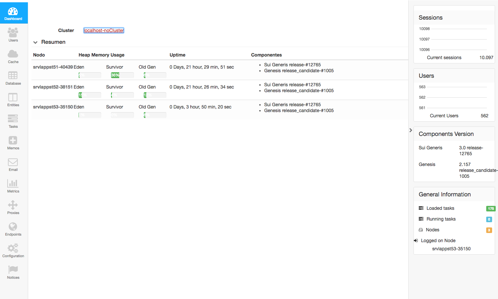

#Console
The Console Application is used to manage Sui Generis.
Once logged, a task bar is shown on the left, listing all sections.
And a status Bar on the right showing current status.

##Status Bar
Status Bar lists:

- Sessions: Graphic with the currently open sessions
- Users: Graphic showing the quantity of logged users
- Components: List of components and versions
- General Information: Summary for the loaded and currently executing tasks.
<!-- >##Managing memos
Memos can be forced to be calculated on next get() invocation from the Admin Console.
Memos can be forced to be calculated across the cluster using method tekgenesis.cluster.jmx.Memos.forceCluster()<-->

<!-- Do not remove images are being copied!!>@copy(../projects/admin/src/main/resources/img /gen-html/starting/img)<-- >
<!-- Do not remove images are being copied!!>@copy(../projects/console/src/main/resources/img /gen-html/starting/img)<-->

#Sections

- [Dashboard](#dashboard)
- [Users](#users)
- [Cache](#cache)
- [Database](#database)
- [Entities](#entities)
- [Task](#task)
- [Memos](#memos)
- [Email](#email)
- [Metrics](#metrics)
- [Proxies](#proxies)
- [Endpoints] (#endpoints)
- [Configuration](#configuration)
- [Notices](#notices)

@inline(../../../../projects/console/src/main/resources/help/tekgenesis/console/UsersForm_en.md)
@inline(../../../../projects/console/src/main/resources/help/tekgenesis/console/CacheForm_en.md)
@inline(../../../../projects/console/src/main/resources/help/tekgenesis/console/DatabaseForm_en.md)
@inline(../../../../projects/console/src/main/resources/help/tekgenesis/console/EntitiesForm_en.md)
@inline(../../../../projects/console/src/main/resources/help/tekgenesis/console/TaskDashboard_en.md)
@inline(../../../../projects/console/src/main/resources/help/tekgenesis/console/MemosForm_en.md)
@inline(../../../../projects/console/src/main/resources/help/tekgenesis/console/EmailForm_en.md)
@inline(../../../../projects/console/src/main/resources/help/tekgenesis/console/Metrics_en.md)
@inline(../../../../projects/console/src/main/resources/help/tekgenesis/console/WebProxiesForm_en.md)
@inline(../../../../projects/console/src/main/resources/help/tekgenesis/console/EndpointsForm_en.md)
@inline(../../../../projects/console/src/main/resources/help/tekgenesis/console/ConfigurationForm_en.md)
@inline(../../../../projects/console/src/main/resources/help/tekgenesis/console/AdviceForm_en.md)

<!-- >
#OldStuff
@inline(../../../../projects/console/src/main/resources/help/tekgenesis/console/ClusterDashBoardForm_en.md)

@inline(../../../../projects/console/src/main/resources/help/tekgenesis/console/package-info_en.md)

@inline(../../../../projects/console/src/main/resources/help/tekgenesis/console/UpdateVersionForm_en.md)
< -->