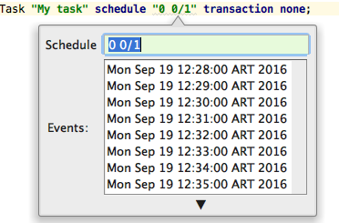

# Tasks

Tasks are a powerful way to perform asynchronous operations. 
There are four type of tasks: [runnable](#runnable-tasks), [processor](#processor-tasks), [lifecycle](#lifecycle-tasks), [importer](#importer-tasks).
Sui Generis also supplies a set of [Built-in Tasks](#built-in-tasks)

## Runnable tasks

This tasks have only one method *run* that should be implemented by the user. This method returns a Status. 
Runnable tasks can define a *schedule* to run. Schedule can later be overridden through properties, and later on in the console.  
The user can specify if the transaction is handled by the task itself specifying the option *transaction none*.

The granularity of the transaction is handled using the *transaction* option with the following values:

* none : Transaction handled by the user.
* all : Transaction is committed after processing all the batch.
* each *n*: Transaction is committed each *n* iterations.
* isolated: Each item of the batch is handled isolated from the other. This means that if some exception is thrown during the process of one item, it is logged and the processing continues with the rest of the items.  


```
task MyTask "My task" schedule "0 0/1" transaction none;
```

```java
/**
 * User class for Task: MyTask
 */
public class MyTask extends MyTaskBase {
    
    /** Invoked when the Server is shutting down. */
	@NotNull @Override public Status run() {
    	// do something.
    	return Status.ok();
	}

}
```

### Schedule
Tasks can define a schedule of the form ´<CRON EXP>´. When this schedule is defined in the mm the Idea Plugin provides a "preview" feature to be able to foresee when the task will be executed.
By pressing ´<ALT><ENTER>´ on the cron expression, and choosing "show future schedules" the following popup will appear:


  
This same schedule can be overwritten later from the properties. To override, property must be of the form:
´ <TASK_NAME>.task.cron=<CRON EXP> ´

Also, the cron expression can be later modified from the console. And the value will be stored in the db. 
Remember that they override one another, so if an expression is specified in the console it will override the properties and the mm specified ones. In the same way, the properties will override the mm.

### Max Running Time
Task's maxRunningTime can be also specified through properties. ´<TASK_NAME>.task.maxRunningTime=<TIME>´.
This time interval, specifies the expected maximum running time for a task, if a task exceeds this period, it will be terminated. The task will be terminated by the  Sui Generis Task Monitor Built-In task (see [Built-In tasks](#Built-In-tasks).


## Processor tasks

Processor tasks are like runnable tasks but meant to work with batches. The user must implement the *enumerate* method that returns the collection of items to process and the *process* method. The granularity of the transaction is handled using the *transaction* option with the following values:

* none : Transaction handled by the user.
* all : Transaction is committed after processing all the batch.
* each *n*: Transaction is committed each *n* iterations.
* isolated: Each item of the batch is handled isolated from the other. This means that if some exception is thrown during the process of one item, it is logged and the processing continues with the rest of the items.
  
The process method returns a Status. There are 4 types of Status:

* ok() : The item is processed without errors, depending of the transaction mode and item processed the transaction is committed.
* done(): The item is processed without errors but the batch processing is stopped.
* error(msg): There was an error with the processing and the batch continues with the next item.
* abort(msg): There was an error with the processing and the batch processing is stopped.
* ignore(msg): The current item is ignored and the batch processing continues with the next item.
* undo(msg): The current item is ignored and  the batch processing is stopped.

The main difference between ignore/undo and error/abort is the log level used to log the cause.

```
processor task ProcessTask "Process task" schedule "0 0/1" transaction each 100;
```

```java
/**
 * User class for Task: ProcessTask
 */
public class ProcessTask extends ProcessTaskBase<Object> {
	...
    @Nullable @Override public Seq<Object> enumerate() { return Colls.list(new Object[100]); }

    @Nullable @Override public Status process(@Nullable Object o) {
		...
        return Status.ok();
    }
}
```

Processor tasks supports callback method for some events

| Method  | Description |
|---|---|
| after()  | Called after processing all items. It is independent of the Task's transaction and It has his own transaction and it is automatically committed/rolled-back.|
| afterAbort() | Called after roll-backing because a Status.abort has been found. |
| before() |  Called before starting processing items.* It is independent of the Task's transaction and It has his own transaction and it is automatically committed/rolled-back. |
| onBegin() | Called after starting a transaction. |
| onCommit() | Called before a transaction is committed. |
| onRollback() | Called before a transaction is rolled-back. |

## Lifecycle tasks

This tasks are executed when a Sui Generis node is started and during shutdown. Lifecycle tasks can be cluster or node. The first ones are executed in the first node is started and the first node shutdown, the latter are executed on every node that is started or shutdown.
If neither is specified, they are treated as node.


```
lifecycle task ClusterTask "Cluster task" cluster;
 
lifecycle task NodeTask "Node task" node;
```

```java
/**
 * User class for Task: ClusterTask
 */
public class ClusterTask extends ClusterTaskBase {
    //~ Methods ..................................................................................................................
    /** Invoked when the Server is shutting down. */
	@NotNull @Override public Status onShutdown() {
    	....
    	return Status.ok();
	}

	/** Invoked when the Server is starting. */
	@NotNull @Override public Status onStartup() {
    	....
    	return Status.ok();
	}
}
```

```java
/**
 * User class for Task: NodeTask
 */
public class NodeTask extends NodeTaskBase {
    //~ Methods ..................................................................................................................
    /** Invoked when the Server is shutting down. */
	@NotNull @Override public Status onShutdown() {
    	....
    	return Status.ok();
	}

	/** Invoked when the Server is starting. */
	@NotNull @Override public Status onStartup() {
    	....
    	return Status.ok();
	}
}
```

## Importer tasks

This task are defined to process files from the filesystem and are useful to import data into instances. The user must implement two *process* methods, one that receives a file and another one that receives a qualified entity name and a file. And optional pattern attribute can be defined to filter the kind of files the task can handle.

```
importer task MyImportTask "My import task" pattern "*.xml";
```

```java
/**
 * User class for Task: MyImportTask
 */
public class MyImportTask extends MyImportTaskBase {
	@Override public void process(final File file) {
 		....
	}

	@Override public void process(final QName model, final File file) {
   	....
	}
}
```

# <a name="built-in-tasks"></a> [Built-in Tasks](#built-in-tasks)


The following task are provided by the product

| Task  | Description |
|---|---|
| [Resource GC](entities/resources.html#built-in-GC-Task) | Garbage collector for resources. |
| Retry Send email | Email sender for all email pending to send |
| Sui Generis Advisor | It collects information about warnings on the system, for instance, deadlocks in the database. |
| Sui Generis Task Purger | It purges all the tasks that are not running in any node. |
| Sui Generis Task Monitor | It monitors the running task in the current node. It will restart or cancel the task if it exceeded the running time or is not responding. This task runs in a node. |

Sui Generis Task Monitor schedule can be modified through properties or console, as specified before for any Runnable Task.